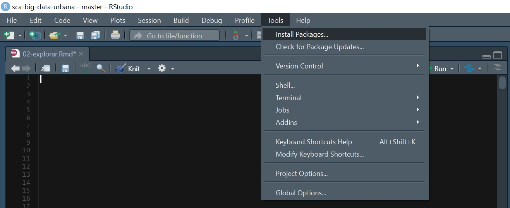
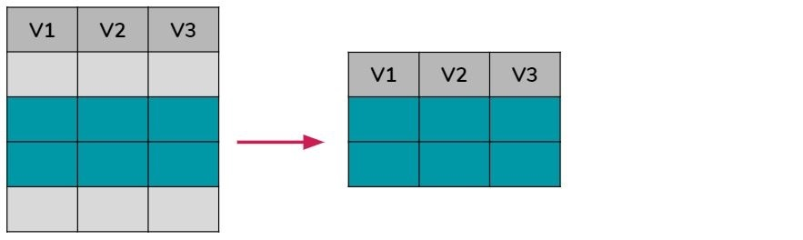

# MANIPULAR

Ahora que ya sabemos abrir un dataset y conocer que información tiene, vamos a aprender a manipular y transformar los datos. Para esto vamos a trabajar con uno de los paquetes más usados y más útiles de R que se llama `tidyverse`.

Pero, **¿Qué es un paquete?**

Cuando instalamos R ya viene con múltiples funciones básicas para manipular datos, sin embargo el potencial de R surge con la posibilidad de incorporar constantemente nuevas funciones que nos permitan realizar nuevas tareas o mejorar el resultado de las ya existentes.

Estos grupos de funciones son a los que llamamos paquetes o packages y para poder utilizarlos es necesario **instalarlos por única vez en la computadora**, y luego **activarlos cada vez que vayamos a usarlos**.

Comencemos instalándolo. Esto podemos hacerlo manualmente en Tools/Install packages:



O directamente escribiendo `install.packages()` adentro de un chunk:

```{r}
#install.packages("tidyverse")
```

Una vez que instalamos el paquete, no vamos a tener que volver a hacerlo. Solamente vamos a tener que "activarlo" cada vez que queramos usarlo. Esta activación se hace con `library()` así:

```{r}
library(tidyverse)
```

Ahora volvamos a cargar nuestro dataset (el mismo de la clase anterior):

```{r}
datos_amba <- read.csv("data/amba_properati.csv")
```

A continuación veremos como el paquete `tidyverse` nos va a permitir manipular nuestros datos a partir de las funciones: **filtrar**, **modificar**,  **seleccionar**, **ordenar**, **renombrar**, **resumir** y **agrupar**.

Aprender a utilizar todas estas funciones es muy importante ya que la **comprensión, transformación y limpieza de los datos** es la etapa que más tiempo nos llevará a la hora de encarar cualquier proyecto de Ciencia de Datos.

## Filtrar

Como su nombre lo indica, esta función hace referencia a realizar un filtro determinado sobre los registros/filas de toda la base de datos, es decir, quedarnos solo con las filas que cumplan cierta condición establecida. Gráficamente se vería como algo así:



Esto nos será muy útil si por algún motivo queremos dejar de lado registros y utilizar solo una parte de la base. Por ejemplo, en el caso de nuestro dataset, que ya vimos que incluye datos de AMBA y CABA, podríamos filtrar la data y quedarnos solo con los registros ubicados en CABA:

```{r}
filtro <- filter(datos_amba, provincia=="CABA")

head(filtro)
```

O los del mes de Julio 2020:

```{r}
filtro <- filter(datos_amba, created_on==202007)

head(filtro)
```

Nótese que para filtrar bajo la condición de "igual" utilicé "==", pero también podría haber utilizado otras condiciones como:

- **A==B**     -> A igual a B
- **A!=B**     -> A diferente a B
- **A<B**      -> A menor a B
- **A<=B**     -> A menor o igual a B
- **A>B**      -> A mayor a B
- **A>=B**     -> A mayor o igual a B
- **is.na(A)** -> A tiene valor nulo (NA)
- **!is.na(A)**-> A no tiene valor nulo (NA)
- **A%in%B**   -> A incluye el valor B
- **!(A%in%B)**-> A no incluye el valor de B

Entonces, por ejemplo si quiero quedarme solo con las propiedades que tienen una superficie cubierta mayor o igual a 75m2 debería escribirlo así:

```{r}
filtro <- filter(datos_amba, surface_covered>=75)

head(filtro)
```

O si quiero eliminar los registros que corresponden a departamentos debería hacer el siguiente chunk:

```{r}
filtro <- filter(datos_amba, property_type!="Departamento")

head(filtro)
```

Si queremos filtrar todas las propiedades ubicadas en 3 partidos diferentes como por ejempo La Plata, General San Martín y La Matanza debemos utilizar %in% de la siguiente forma:

```{r}
filtro <- filter(datos_amba, partido %in% c("La Plata", "General San Martín", "La Matanza"))

head(filtro)
```

En cambio, si queremos filtrar todas las propiedades que no estén ubicadas en 3 partidos diferentes como por ejempo La Plata, General San Martín y La Matanza debemos utilizar ! + %in% de la siguiente forma:

```{r}
filtro <- filter(datos_amba, !(partido %in% c("La Plata", "General San Martín", "La Matanza")))

head(filtro)
```

Pero esto no es todo, ¿Cómo hago si quiero filtrar por **2 o más condiciones a la vez**?

En este caso debemos utilizar los siguientes operadores lógicos:

- condición 1 **&** condición 2        -> se cumplen ambas condiciones a la vez
- condición 1 **|** condición 2        -> se cumple una u otra de las condiciones
- condición 1 **& !** condición 2      -> se cumple la condición 1 pero no la condición 2
- **!**condición 1 **&** condición 2   -> no se cumple la condición 1 pero si la condición 2
- **!**(condición 1 **&** condición 2) -> no se cumple ninguna de las 2 condiciones 

Por ejemplo, si queremos filtrar todos los registros pertenecientes a la Comuna 5 y a la Comuna 13:

```{r}
filtro <- filter(datos_amba, partido=="Comuna 5" & partido=="Comuna 13")

head(filtro)
```

El resultado es 0 porque un registro no puede pertenecer a ambas comunas al mismo tiempo, sin embargo si queremos filtrar aquellos que pertenecen a una u otra podemos hacerlo así:

```{r}
filtro <- filter(datos_amba, partido=="Comuna 5" | partido=="Comuna 13")

head(filtro)
```

También podemos quedarnos con aquellas propiedades que estén en alquiler y que tengan más de 50m2:

```{r}
filtro <- filter(datos_amba, operation_type=="Alquiler" & surface_covered>=50)

head(filtro)
```

O con aquellas propiedades que se ubiquen en la Comuna 12, 13 o 14 y que no sean monoambientes:

```{r}
filtro <- filter(datos_amba, partido %in% c("Comuna 14", "Comuna 13", "Comuna 12") & ! rooms==1)

head(filtro)
```

¡Y así se pueden hacer todas las combinaciones de filtros que querramos!

¿Y si en vez de quitar filas queremos quitar columnas? Bueno, aquí tenemos que usar la función de "seleccionar" que veremos a continuación.

## Seleccionar

La función `select()` nos permite elegir u ordenar columnas de nuestro dataset. Esto se puede hacer indicando los nombres completos de las columnas, palabras que contienen, o la letra con la que empiezan o terminan.

Graficamente sería algo así:


Por ejemplo, de la siguiente forma podríamos quedarnos solo con las columnas created_on, provincia, price y currency:

```{r}
seleccion <- select(datos_amba, created_on, provincia, price, currency)

head(seleccion)
```

También podríamos elegir que columna/s no queremos tener más en nuestro dataset agregando un "-" antes de su nombre:

```{r}
seleccion <- select(datos_amba, -title)

head(seleccion)
```

Con ":" podríamos indicar que queremos seleccionar un rango de columnas. Desde price hasta operation_type:

```{r}
seleccion <- select(datos_amba, price:operation_type)

head(seleccion)
```

O con las que ocupan de la posición 7 a la 10:

```{r}
seleccion <- select(datos_amba, 7:10)

head(seleccion)
```

O agregando un "-" adelante podríamos quedarnos con aquellas que no ocupan de la posición 7 a 10:

```{r}
seleccion <- select(datos_amba, -(7:10))

head(seleccion)
```

Otra opción es seleccionar columnas de acuerdo a la primer letra de los nombres. Por ejemplo aquellas que comienzan con la letra "p":

```{r}
seleccion <- select(datos_amba, starts_with("p"))

head(seleccion)
```

O aquellas que sus nombres terminan con la letra "e":

```{r}
seleccion <- select(datos_amba, ends_with("e"))

head(seleccion)
```

O que sus nombres contengan la palabra "surface":

```{r}
seleccion <- select(datos_amba, contains("surface"))

head(seleccion)
```

## Modificar

Ahora veamos como mutar nuestro dataset agregando nuevas columnas o cambiando el contenido de las existentes. Gráficamente sería algo así:


Aprovechando que tenemos los datos del precio total (price) y superficie cubierta (surface_covered) de cada una de las propiedades, agreguemos una nueva columna a nuestro dataset que incluya el valor del m2:

```{r}
modificar <- mutate(datos_amba, price_m2=price/surface_covered)

head(modificar)
```

Si queremos redondear el resultado obtenido, principalmente cuando es una división y por default nos pone varios decimales, tenemos que usar `round()` y asignar la cantidad de decimales deseados, en este caso usaré 2:

```{r}
modificar <- mutate(datos_amba, price_m2=round(price/surface_covered, 2))

head(modificar)
```

Como verán, para hacer cálculos entre columnas numéricas podemos utilizar:

- **A/B** A dividido B
- **A*B** A multiplicado por B
- **A+B** Suma de A y B
- **A-B** Resta de A menos B

También podríamos agregar una columna que refleje un cálculo entre una columna existente y un valor extra, por ejemplo pasemos la superficie total de m2 a cm2:

```{r}
modificar <- mutate(datos_amba, surface_total_cm2=surface_total*10000)

head(modificar)
```

Dejando de lado los cálculos, otra posibilidad que tenemos es separar el contenido de una columna en 2, por ejemplo dividamos en año y mes la data que aparece en created_on. Para esto utilizaremos `substr()`:

```{r}
modificar <- mutate(datos_amba,
                    year = substr(created_on, 1, 4),
                    month = substr(created_on, 5, 6))

head(modificar)
```

Otra aplicación que tiene `mutate()` es la de agregar columnas con algun contenido que elijamos nosotros, como por ejemplo sumemos una nueva columna que indique la fuente de donde descargamos toda esta información:

```{r}
modificar <- mutate(datos_amba, fuente="Properati")

head(modificar)
```

Ahora veamos como modificar el tipo de dato dentro de una columna:

```{r}
class(datos_amba$title)
```

Vemos que la variable "title" es de tipo factor, así que cambiemos su formato a character:

```{r}
modificar <- mutate(datos_amba, title=as.character(title))

class(modificar$title)
```

En el ejemplo anterior utilizamos `as.character()` pero si quisiesemos convertir una variable a factor utilizariamos `as.factor()`, a numérica `as.numeric()` o a número entero `as.integer()`,

Por último, veamos como unir 2 columnas de texto en una con `paste()`:

```{r}
modificar <- mutate(datos_amba, prov_partido=paste(provincia, partido, sep="_"))

head(modificar)
```

## Ordenar

Esta función nos permitirá ordenar las columnas en orden ascendente o descendente como se ve a continuación:


Probemos ordenar las filas de nuestro data frame en función de los valores de una o más columnas. Por defecto se ordena en forma ascendente:

```{r}
ordenar <- arrange(datos_amba, surface_total)

head(ordenar)
```

Pero si queremos ordenar en forma descendente debemos aclararlo con `desc()`:

```{r}
ordenar <- arrange(datos_amba, desc(surface_total))

head(ordenar)
```

También podemos ordenar por 2 o más columnas. En este caso, R priorizará ordenar la primera, luego la segunda, y asi sucesivamente. Veamos un ejemplo:

```{r}
ordenar <- arrange(datos_amba, partido, rooms)

head(ordenar)
```

```{r}
ordenar <- arrange(datos_amba, partido, desc(rooms))

head(ordenar)
```

## Renombrar

Ahora veamos como cambiar los nombres a una o más columnas existentes en nuestro dataset:


Empecemos cambiando el nombre de la variable "rooms" por "ambientes":

```{r}
renombrar <- rename(datos_amba, ambientes=rooms)

head(renombrar)
```

Como habrán notado, primero hay que poner el nombre de la nueva columna y luego el de la columna actual. Esto es muy importante, porque si lo hacemos al revés nos dará un error.

Ahora veamos un ejemplo y cambiemos los nombres de 3 columnas:

```{r}
renombrar <- rename(datos_amba, ambientes=rooms, m2_cubierto=surface_covered, m2_total=surface_total)

head(renombrar)
```

## Resumir y Agrupar

Esta función es súper útil cuando manipulamos datos ya que nos permitirá realizar resumenes/sumarios de la data completa, obteniendo por ejemplo valores promedio, máximos o mínimos de una o más columnas.


Probemos calculando la mediana de todos los valores que aparecen en la columna surface_covered:

```{r}
summarise(datos_amba, surface_covered=median(surface_covered))
```

O calculemos un promedio de toda la columna surface_total:

```{r}
summarise(datos_amba, surface_covered=mean(surface_covered))
```

También podemos averiguar el valor máximo o mínimo de alguna variable:

```{r}
summarise(datos_amba, surface_covered=max(rooms))
```

```{r}
summarise(datos_amba, surface_covered=min(rooms))
```

Como verán, esta función resulta útil para ver valores agregados de toda la base, sin embargo, también podemos agrupar los datos previo a calular los resumenes, y así obtener resumenes por agrupaciones en vez de uno solo para toda la base. Para esto vamos a utilizar `summarise()` junto a `group_by()`. Veamos un ejemplo:

- Primero agrupemos los datos por la variable "operation_type".

- Luego calculemos el promedio de superficie cubierta sobre la agrupación realizada previamente.

```{r}
agrupar <- group_by(datos_amba, operation_type)

resumir <- summarise(agrupar, surface_covered=mean(surface_covered))

head(resumir)
```

Con la agrupación y el resumen podemos ver que la superficie cubierta promedio de las propiedades en alquiler es 72,93m2 y la de las propiedades en venta es 97,28m2.

Probemos agrupando por 3 columnas:

```{r}
agrupar <- group_by(datos_amba, operation_type, currency)

resumir <- summarise(agrupar, price_m2=mean(price/surface_covered))

head(resumir)
```

El valor del m2 promedio para las propiedades en Alquiler es de 520 $ARS mientras que para las propiedaes en venta es de 2.689 USD. Sin embargo, está claro que en el valor de CABA y GBA es diferente, así que calculemos el valor del m2 promedio para cada uno:

```{r}
agrupar <- group_by(datos_amba, operation_type, currency, provincia)

resumir <- summarise(agrupar, rooms=mean(price/surface_covered))

head(resumir)
```

Se ve claramente que hay una diferencia entre CABA y GBA, siendo CABA más caro para ambos tipos de operación. Por último probemos desagregando esta información por partido:

```{r}
agrupar <- group_by(datos_amba, operation_type, currency, partido)

resumir <- summarise(agrupar, price_m2=mean(price/surface_covered))

head(resumir)
```

## Concatenar funciones (%>%)

Llegamos al final de la clase, ya vimos varias funciones por separado, pero ¿Qué pasa si queremos aplicarlas todas a la vez? ¿Cómo podemos hacerlo?

En este caso debemos usar el operador pipe (%>%) **Ctrl+Shift+M** que sirve para encadenar funciones, y en vez de realizar una por una, poder realizar todas juntas.

Veamos algunos ejemplos:

Imaginemos que queremos calcular por mes y para cada provincia (CABA y GBA) cuantas propiedades hubo en venta, con que valor total promedio, con que valor del m2 promedio y con que superficie promedio. Así lo tenemos que hacer según lo aprendido hasta ahora:

```{r}
concatenar <- filter(datos_amba, operation_type=="Venta")

concatenar <- select(concatenar, created_on, provincia, surface_covered, price)

concatenar <- group_by(concatenar, created_on, provincia)

concatenar <- summarise(concatenar, cantidad=n(),
                        price=mean(price),
                        surface_covered=mean(surface_covered),
                        price_m2=price/surface_covered)

head(concatenar)
```

Y así lo deberíamos hacer con pipe %>%:

```{r}
concatenar <- datos_amba %>%
  filter(operation_type=="Venta") %>%
  select(created_on, provincia, surface_covered, price) %>%
  group_by(created_on, provincia) %>%
  summarise(cantidad=n(),
            price=mean(price),
            surface_covered=mean(surface_covered),
            price_m2=price/surface_covered)

head(concatenar)
```

A partir de la agrupación y resumen por ejemplo podemos ver que:

- En ambos meses, en CABA hubo mayor cantidad de propiedades en venta.
- En ambos meses, la superficie cubierta de las propiedades en venta en GBA son mayores que las de CABA.
- En ambos meses el valor promedio del m2 es más alto en CABA que ne GBA.
- En ambas zonas (CABA y GBA), entre Junio y Julio 2020 hubo una caída en la cantidad de propiedades publicadas y en el valor promedio del m2.

Como verán, en ambos casos llegamos al mismo resultado, pero sin dudas, la segunda opción es la recomendable porque nos ahorramos varias líneas de código y resultados intermedios.