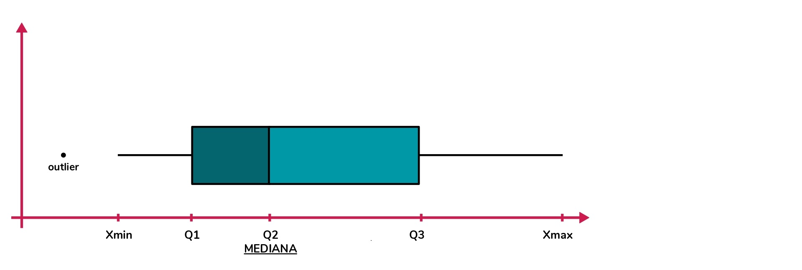

# ANÁLISIS Y VISUALIZACIÓN DE DATOS

El paquete `tidyverse` incluye diversos paquetes, entre los que se encuentra `ggplot2`, que nos permite realizar diferentes tipos de gráficos a partir de nuestros datos.

Hasta acá ya sabemos abrir, conocer, manipular y transformar un dataset, así que ahora nos enfocaremos en el **desarrollo de visualizaciones** que nos permitirán comunicar de forma gráfica lo que dicen nuestros datos.

En la estructura del código necesario para realizar un gráfico con `ggplot2` hay que determinar lo siguiente:

- **Dataset a utilizar**: hay que indicar el dataset al inicio del código en **ggplot(dataset)**.
- **Tipo de Gráfico** a realizar: puede ser de puntos, barras, líneas, áreas, matriz, histograma, densidad, etc. Estos elementos funcionan como "capas" ya que pueden utilizarse más de uno a la vez en un mismo gráfico y sus códigos se escriben **geom_hist()**, **geom_tile()**, **geom_bar()**, etc.
- **Atributos Estéticos** que dependen de una o más columnas del dataset: variables a utilizar en ejes x e y, colores, tamaños, formas, transparencias, etc. Siempre se asignan dentro de **aes()**.
- **Etiquetas** que ayudan a la interpretación de las visualizaciones. Estas son: títulos, subtítulos, leyendas, etc. Se asignan dentro de **labs()**.
- **Facetas** a utilizar: de acuerdo a alguna columna del dataset dividen el gráfico manteniendo las escalas. Esto es opcional y se hace con **facet_grid()**.
- **Temas** que permiten elegir la estética general del gráfico (color de fondo, tamaño de márgenes, etc). Algunos son **theme_void()**, **theme_dark()**, etc.

A continuación seguiremos trabajando con los datos de Properati de Junio y Julio 2020 en AMBA y desarrollaremos diferentes visualizaciones que sinteticen y comuniquen la información que contiene.

En particular, veremos como representar gráficamente lo siguiente:

- Distribución de una variable continua
- Distribución de valores continuos asociados a una variable categórica
- Relación entre variables continuas
- Relación entre variables categóricas
- Relación entre una variable continua y una categórica

Empecemos activando la librería `tidyverse`:

```{r}
library(tidyverse)
```

Y volvamos a cargar nuestro dataset:

```{r}
datos_amba <- read.csv("data/amba_properati.csv")
```

## Distribución de una variable continua

### Histograma

Los histogramas muestran gráficamente, a partir de barras, la distribución de una variable continua, es decir la frecuencia con la que aparece cada valor numérico en una determinada columna del dataset. En el eje X se representa la variable continua y en el eje Y la frecuencia de la misma.

Para generar este tipo de visualización utilizaremos `ggplot()` + `geom_histogram()`. Veamos por ejemplo como se distribuyen las superficies cubiertas (surface_covered) de las propiedades publicadas:

```{r}
ggplot(datos_amba)+
  geom_histogram(aes(x=surface_covered))
```

El eje X muestra la cantidad de m2 cubiertos que tienen las propiedades publicadas y el eje Y la cantidad de veces que aparece cada superficie. Por lo tanto, podemos ver que hay muchas propiedades con "poca" superficie cubierta y pocas propiedades con "mucha" superficie cubierta.

Para facilitar la interpretación, podemos modificar el ancho de las barras (bins) que por defecto el valor es 30. Probemos con bins=75:

```{r}
ggplot(datos_amba)+
  geom_histogram(aes(x=surface_covered), bins=75)
```

¿Notan el cambio? El eje Y disminuyó porque los conteos se agruparon en intervalos más pequeños sobre el eje X.

Podemos observar que hay más propiedades por debajo de los 100m2 cubiertos que por encima, y que la mayor cantidad de observaciones se ubica alrededor de los 50m2. También podemos detectar algunos outliers que tienen alrededor de 800m2.

Pero desagreguemos aún más nuestros datos y sumemos una variable categórica (tipo de operación) que nos permita facetar/dividir el gráfico. Para esto utilizaremos `facet_grid()`:

```{r}
ggplot(datos_amba)+
  geom_histogram(aes(x=surface_covered), bins=75) +
  facet_grid(operation_type~.)
```

La tendencia se mantiene similar en ambos casos, con una mayoría de propiedades de aproximadamente 50m2 cubiertos. Sin embargo, se detecta una gran diferencia en la cantidad de propiedades publicadas para cada tipo de operación.

Incorporemos una variable más (provincia) que nos permita comprender si los comportamientos de la variable surface_covered cambian entre CABA y PBA. En este caso la agregaremos como un color de relleno (fill):

```{r}
ggplot(datos_amba)+
  geom_histogram(aes(x=surface_covered, fill=provincia), bins=75)+
  facet_grid(operation_type~.)
```

Podemos ver que tanto en CABA como en AMBA, los comportamientos de la variable analizada son similares.

Por último probemos sumar una variable más dentro del facetado (fecha de publicación), agreguemos etiquetas (labs) y elijamos los colores del gráfico (scale_fill y theme).

Cabe destacar que hay 2 tipos de escalas de color:

- Las ya establecidas (listas para usar): Brewer, Viridis. Recomiendo utilizar estas que en `ggplot2` las van a encontrar como scale_fill_viridis_c(), scale_fill_brewer() y demás variantes.

- Las personalizadas, donde nosotros elegimos todos los colores: Gradiente (scale_fill_gradient()), Manual (scale_fill_manual())
*Para obtener un listado de colores pueden ver [este link](http://www.stat.columbia.edu/~tzheng/files/Rcolor.pdf)*

```{r}
ggplot(datos_amba)+
  geom_histogram(aes(x=surface_covered, fill=provincia), bins=75)+
  facet_grid(created_on~operation_type)+
  labs(title="M2 cubiertos según Zona, Operación y Fecha de Publicación",
       fill="Zona",
       x="Superficie cubierta (M2)",
       y="Cantidad",
       caption="Fuente: Properati Junio y Julio 2020")+
  scale_fill_manual(values = c("goldenrod2", "indianred2"))+
  theme_light()
```

En el histograma anterior se puede ver que si bien en ambos meses las distribuciones se mantienen, en Junio hay mayor cantidad de publicaciones que en Julio.

### Gráfico de Densidad

Este tipo de gráfico cumple la misma función que el Histograma, pero se caracteriza por generar una versión más "suavizada" en la que muestra la densidad de kernel a lo largo de toda la variable continua y no conteos por bins. Estos gráficos nos permiten ver cuales son los intervalos de la variable continua donde hay mayor probabilidad de encontrar registros.

Para generar esta visualización utilizaremos `ggplot()` + `geom_density()`. Veamos por ejemplo como se distribuyen los valores por m2 (price/surface_covered) de las propiedades publicadas:

```{r}
ggplot(datos_amba)+
  geom_density(aes(x=price/surface_covered))
```

En primer lugar, tenemos los valores del eje Y en notación científica. Si queremos evitar esto es necesario que escribamos la siguiente línea de código:

```{r}
options(scipen=999)
```

Y ahora si, ejecutar nuevamente el chunk anterior:

```{r}
ggplot(datos_amba)+
  geom_density(aes(x=price/surface_covered))
```

En el gráfico se ven 2 "picos" muy pronunciados que indican en que partes del intervalo se concentran los valores. Esto podría deberse a que estamos trabajando con ambos tipos de operación (Alquiler y Venta), y como todos sabemos, los valores del m2 de ambos son muy diferentes, tanto por la moneda (ARS vs USD) como por los montos.
Por lo tanto, es muy probable que cada uno de esos "picos" se corresponda al valor del m2 de cada una de las operaciones. Para poder desemascarar esto recurramos nuevamente al facetado:

```{r}
ggplot(datos_amba)+
  geom_density(aes(x=price/surface_covered), fill="gray") +
  facet_grid(operation_type~.)
```

Las operaciones tienen una distribución del valor del m2 muy diferentes entre sí. Se ve muy claro que los alquileres tienen un rango de precios que va desde 300 a 500$ARS aprox mientras que las ventas distribuyen sus publicaciones a lo largo de un rango bastante mayor entre 1.500USD y 3.500USD aproximadamente.

Pero como los precios también deberían variar bastante de acuerdo a la zona geográfica, probemos agregar una variable categórica más que nos ayude a diferenciar CABA de GBA:

```{r}
ggplot(datos_amba)+
  geom_density(aes(x=price/surface_covered, fill=provincia), alpha=0.5) +
  facet_grid(operation_type~.)
```

Obviamente para cada partido, localidad y calle específica los valores van a variar, pero a simple vista podríamos notar que en ambos casos el valor del m2 de la mayoría de propiedades es mayor en CABA.

Ahora analicemos como se comporta el valor del m2 de venta según el tipo de propiedad en CABA y GBA y aprovechemos para agregar etiquetas y colores a nuestro gráfico:

```{r}
ggplot(datos_amba %>%
         filter(operation_type=="Venta"))+
  geom_density(aes(x=price/surface_covered, fill=provincia), alpha=0.5) +
  facet_grid(property_type~.)+
  labs(title="Valor del m2 en Venta según Zona y Tipo de Propiedad",
       fill="Zona",
       x="Valor m2",
       y="Densidad",
       caption="Fuente: Properati Junio y Julio 2020")+
  scale_fill_manual(values = c("goldenrod2", "indianred2"))+
  theme_light()
```

En las 3 tipologías de vivienda los valores del m2 que predominan en CABA son mayores a los de GBA.

Y ahora elijamos 3 partidos para comparar:

```{r}
ggplot(datos_amba %>%
         filter(operation_type=="Venta" & partido==c("Vicente López", "La Matanza", "La Plata")))+
  geom_density(aes(x=price/surface_covered, fill=partido), alpha=0.5) +
  facet_grid(property_type~.)+
  labs(title="Valor del m2 en Venta por Partido y Tipo de Propiedad",
       fill="Zona",
       x="Valor m2",
       y="Densidad",
       caption="Fuente: Properati Junio y Julio 2020")+
  theme_light()
```

En las 3 tipologías se ve que Vicente López tiene los precios más elevados por m2, y a su vez que los departamentos de La Matanza superan en precio a los de La Plata. Sin embargo, para casas y PHs, La Matanza y La Plata tienen precios muy similares.

## Distribución de valores continuos asociados a una variable categórica: Gráfico de Cajas

Un Gráfico de Cajas sirve para comparar la distribución y tendencia central de varias categorías de una variable.

Veamos como luce un gráfico de este tipo:



Para cumplir con el objetivo de analizar la distribución de una determinada muestra de datos, **la visualización distribuye los datos en cuartiles: Q1, Q2 y Q3**. Cabe destacar que, los cuartiles son los valores que dividen a la muestra (cantidad de registros) en 4 partes iguales.

**Q1**: El primer cuartil está representado por el mayor valor incluido en el 1/4 más bajo. Es decir que, el 25% de la muestra de datos es menor que este valor.

**Q2**: El segundo cuartil está representado por el mayor valor incluido en el 2/4. Es decir que, el 50% de la muestra de datos es menor que este valor. Este valor indica la **mediana de la serie**.

**Q3**: El tercer cuartil está representado por el mayor valor incluido en el 3/4. Es decir que, el 75% de la muestra de datos es menor que este valor.

En este gráfico también pueden aparecer **outliers**, es decir valores extremos que haya dentro de los conjuntos de datos.

Para generar esta visualización utilizaremos `ggplot()` + `geom_boxplot()`. Veamos por ejemplo como se distribuyen los valores por m2 (price/surface_covered) por zona:

```{r}
ggplot(datos_amba) +
  geom_boxplot(aes(x = provincia, y = price/surface_covered))
```

En el gráfico anterior podemos observar que la mediana del valor del m2 en CABA es superior al de GBA, pero estamos mezclando datos de ambos tipos de operaciones (alquileres y ventas), lo cual no es correcto. Para mejorar este aspecto facetemos el gráfico según tipo de operación:

```{r}
ggplot(datos_amba) +
  geom_boxplot(aes(x = provincia, y = price/surface_covered)) +
  facet_grid(~operation_type)
```

Si bien los valores que se manejan en cada operación son muy diferentes entre sí, en ambos casos se mantiene que la **mediana del valor del m2 en CABA es superior que en GBA**. Sin embargo, como las 2 escalas son muy diferentes, casi no se ven las cajas correspondientes a los alquileres.

Hagamos un filtro por Alquileres para ver mejor que ocurre ahí:

```{r}
ggplot(datos_amba %>%
         filter(operation_type=="Alquiler")) +
  geom_boxplot(aes(x = provincia, y = price/surface_covered, fill=provincia), show.legend = FALSE) +
  labs(title = "Distribución del valor del m2 de Alquileres en CABA y GBA",
       subtitle = "Publicaciones de Junio y Julio 2020",
       y = "Valor del m2",
       x = "Zona",
       caption = "Fuente: Properati")
```

La mediana de CABA está por encima pero claramente dentro de CABA hay muchas diferencias entre Comunas. Grafiquemos esto con datos de CABA desagregados por Comuna:

```{r}
ggplot(datos_amba %>%
         filter(operation_type=="Alquiler" & provincia=="CABA")) +
  geom_boxplot(aes(x = partido, y = price/surface_covered, fill=partido), show.legend = FALSE) +
  labs(title = "Distribución del valor del m2 de Alquileres en CABA y GBA",
       subtitle = "Publicaciones de Junio y Julio 2020",
       y = "Valor del m2",
       x = "Comuna",
       caption = "Fuente: Properati")+
  coord_flip()
```

Se ve que:

- La Comuna 14 y la Comuna 1 tienen una mediana muy similar en el valor del m2 (el más alto de CABA).
- La Comuna 14 presenta la mayor cantidad de outliers, motivo por el cual al calcular promedios siempre está por encima de la Comuna 1.
- La Comuna 1 presenta la mayor variación en el valor del m2: va desde 200ARS hasta 1500ARS aprox. Esto se puede deber a la heterogeneidad de barrios que contiene.
- La Comuna 8 tiene muy pocas observaciones.
- La Comuna 10 presenta el menor valor del m2.

Veamos que pasa si filtramos solo PBA y lo desagregamos por Partido:

```{r}
ggplot(datos_amba %>%
         filter(operation_type=="Alquiler" & provincia=="GBA")) +
  geom_boxplot(aes(x = partido, y = price/surface_covered, fill=partido), show.legend = FALSE) +
  labs(title = "Distribución del valor del m2 de Alquileres en CABA y GBA",
       subtitle = "Publicaciones de Junio y Julio 2020",
       y = "Valor del m2",
       x = "Partido",
       caption = "Fuente: Properati")+
  coord_flip()
```

Acá vemos que:

- Vicente López presenta la mayor variación en el valor del m2 y la mediana más alta de los partidos incluidos en la base.
- Presidente Perón es el partido de la base con menor valor del m2.

Este análisis también podríamos hacerlo comparando entre partidos específicos y diferenciando por mes de publicación, por ejemplo:

```{r}
ggplot(datos_amba %>%
         filter(operation_type=="Alquiler" & partido==c("Vicente López", "La Matanza", "La Plata"))) +
  geom_boxplot(aes(x = partido, y = price/surface_covered, fill=partido), show.legend = FALSE) +
  labs(title = "Distribución del valor del m2 de CABA y GBA",
       subtitle = "Junio y Julio 2020",
       y = "Valor del m2",
       x = "Partido",
       color = "Partido",
       caption = "Fuente: Properati")+
  facet_grid(created_on~.)+
  scale_fill_brewer(palette = "Set3")+
  coord_flip()
```

## Relación entre variables numéricas: Gráfico de Dispersión

Ahora veamos el clásico gráfico de puntos o scatter plot que muestra la dispersión que existe entre 2 variables numéricas representadas en los 2 ejes X e Y, y que permite identificar si existe o no una relación entre ambas.

Veamos por ejemplo, si existe relación entre la superficie cubierta (surface_covered) y el precio total (price) de las propiedades:

```{r}
ggplot(datos_amba)+
  geom_point(aes(x=surface_covered, y=price))
```

Tiene sentido, a mayor superficie cubierta, mayor valor. Pero veamos esto desagregado entre tipos de operaciones a ver que pasa:

```{r}
ggplot(datos_amba)+
  geom_point(aes(x=surface_covered, y=price, color=operation_type), alpha=0.5)
```

A los gráficos de dispersión también se les puede agregar una tercer variable categórica o numérica que puede verse reflejada en la estética de los puntos (color, forma o tamaño).

Agreguemos una tercer variable (categórica) a nuestro gráfico: la provincia

```{r}
ggplot(datos_amba)+
  geom_point(aes(x=surface_covered, y=price, color=operation_type), alpha=0.5) +
  facet_grid(provincia~.)
```

Podemos ver que en GBA no crece tan rápido la relación como en CABA.

Quedemonos solo con las ventas y agreguemos una tercer variable numérica: el valor del m2

```{r}
ggplot(datos_amba %>%
         filter(operation_type=="Venta"))+
  geom_point(aes(x=surface_covered, y=price, color=price/surface_covered), alpha=0.5) +
  facet_grid(provincia~.) +
  scale_color_viridis_c(option="magma")
```

Ahora aprovechemos que tenemos longitud y latitud de cada registro y hagamos un gráfico de puntos que nos permita ver la relación entre ambas variables:

```{r}
ggplot()+
  geom_point(data=datos_amba, aes(x=lon, y=lat))
```

¿A qué se parece? ¿Tiene forma de AMBA? Probemos coloreando según la variable provincia.

```{r}
ggplot()+
  geom_point(data=datos_amba, aes(x=lon, y=lat, color=provincia))
```

## Relación entre variables categóricas: Gráfico de Matriz

Este tipo de gráfico representa un mapa de calor bidimensional que muestra la frecuencia que existe entre 2 variables dentro de la base de datos.

Para poder desarrollar la visualización es necesario elegir 3 variables:

**x**: variable a ubicar en el eje X

**y**: variable a ubicar en el eje Y

**fill**: valor numérico que será representado a partir de los colores

Veamos un ejemplo relacionando el partido y la cantidad de ambientes:

```{r}
ggplot(datos_amba %>%
              group_by(partido, rooms) %>%
              summarise(cantidad=n())) + 
  geom_tile(aes(x = partido,
                y = as.factor(rooms),
                fill = cantidad))
```

Mejoremos con `coord_flip()` el aspecto de la visualización:

```{r}
ggplot(datos_amba %>%
              group_by(partido, rooms) %>%
              summarise(cantidad=n())) + 
  geom_tile(aes(x = partido,
                y = as.factor(rooms),
                fill = cantidad)) +
  scale_fill_viridis_c() +
  coord_flip()
```

Se puede ver por ejemplo que la relación Comuna 14 + 2 ambientes, y Comuna 14 + 3 ambientes es la que más se repite (más de 600 veces cada una). Filtremos solo CABA:

```{r}
ggplot(datos_amba %>%
              filter(provincia=="CABA") %>%
              group_by(partido, rooms) %>%
              summarise(cantidad=n())) + 
  geom_tile(aes(x = as.factor(partido),
                y = as.factor(rooms),
                fill = cantidad)) +
  scale_fill_viridis_c() +
  coord_flip()
```

Obviamente se sigue viendo lo mismo de la Comuna 14 pero también se empieza a ver como la Comuna 13 y 15 también aparecen mucho con propiedades de 2 y 3 ambientes. Veamos el caso de GBA:

```{r}
ggplot(datos_amba %>%
              filter(provincia=="GBA") %>%
              group_by(partido, rooms) %>%
              summarise(cantidad=n())) + 
  geom_tile(aes(x = as.factor(partido),
                y = as.factor(rooms),
                fill = cantidad)) +
  scale_fill_viridis_c() +
  coord_flip()
```

En GBA la mayor cantidad se ve en Tigre con 3 ambientes, seguida por 2 y 4. También hay varias propiedades de 2 y 3 ambientes en La Plata.

## Relación entre variable numérica y categórica: Gráfico de Barras

El gráfico de barras representa, a partir de la longitud de las barras, el valor numérico (eje Y) asociado a cada entidad de la variable categórica (eje X).

Al igual que en el resto de visualizaciones, es necesario elegir una variable para el eje X y otra para el eje Y (acá se llama weight). Sin embargo, si no asignamos ninguna variable numérica a weight, el gráfico automáticamente va a calcular cuantas veces aparece cada categoría en la base de datos.

Por ejemplo, veamos cuantas observaciones hay por tipo de operación:

```{r}
ggplot(datos_amba)+
  geom_bar(aes(x=operation_type))
```

En el gráfico anterior podemos ver que hay alrededor de 12.000 propiedades en venta y 3.000 en alquiler.

Veamos esto desagregado por tipo de propiedad:

```{r}
ggplot(datos_amba)+
  geom_bar(aes(x=operation_type, fill=property_type))
```

Como ya venimos viendo a lo largo de todo el capítulo, predominan los departamentos en ambos casos. Veamos esto también por zona y ajustemos cuestiones estéticas del gráfico:

```{r}
ggplot(datos_amba)+
  geom_bar(aes(x=operation_type, fill=property_type)) +
  scale_fill_manual(values = c("goldenrod2", "turquoise4", "deeppink3")) +
  facet_grid(~provincia)+
  labs(title="Oferta publicada según Zona por Operación y Tipo de Propiedad",
       fill="Tipo",
       x="Operación",
       y="Cantidad",
       caption="Fuente: Properati Junio y Julio 2020")
```

Siguen predominando los departamentos pero también se puede ver como la cantidad de casas en venta en GBA es muy similar a la de departamentos.

Las **barras apiladas con valores absolutos** es una de las opciones a la hora de graficar y la que nos hace por defecto `ggplot2`, pero existen 2 más: las barras apiladas con valores relativos (%) y las barras agrupadas con valores absolutos.

Veamos de que se trata cada una!

**Barras apiladas con valores relativos (%)**

Este tipo de gráfico ayuda a detectar las diferencias relativas que existen entre los valores continuos de cada grupo/categoría. Cada barra del gráfico muestra el total de cada categoría y se representa por el apilado de los porcentajes de cada valor. Con `ggplot()` usaremos `position=position_fill()`:

```{r}
ggplot(datos_amba)+
  geom_bar(aes(x=operation_type, fill=property_type), position=position_fill()) +
  scale_fill_manual(values = c("goldenrod2", "turquoise4", "deeppink3")) +
  facet_grid(~provincia)+
  labs(title="Oferta publicada según Zona por Operación y Tipo de Propiedad",
       fill="Tipo",
       x="Operación",
       y="Porcentaje",
       caption="Fuente: Properati Junio y Julio 2020")
```

**Barras agrupadas con valores absolutos**

Este tipo de gráfico se utiliza cuando los datos absolutos se agrupan en 2 o más categorías dentro del mismo eje. Con `ggplot()` usaremos `position=position_dodge()`:

```{r}
ggplot(datos_amba)+
  geom_bar(aes(x=operation_type, fill=property_type), position=position_dodge()) +
  scale_fill_manual(values = c("goldenrod2", "turquoise4", "deeppink3")) +
  facet_grid(~provincia)+
  labs(title="Oferta publicada según Zona por Operación y Tipo de Propiedad",
       fill="Tipo",
       x="Operación",
       y="Cantidad",
       caption="Fuente: Properati Junio y Julio 2020")
```

Ahora investiguemos otra variable de nuestro dataset, veamos **de cuántos ambientes son las propiedades que predominan en cada zona para cada operación inmobiliaria**:

```{r}
ggplot(datos_amba)+
  geom_bar(aes(x=as.factor(rooms), fill=provincia), position=position_dodge()) +
  labs(title="Oferta de Propiedades en Alquiler",
       subtitle="Según cantidad de ambientes",
       fill="Zona",
       x="Cantidad de Ambientes",
       y="Cantidad",
       caption="Fuente: Properati") +
  scale_fill_manual(values = c("goldenrod2", "indianred2")) +
  facet_grid(operation_type~.)
```

Vemos que:

- Los monoambientes publicados en CABA triplican los publicados en GBA.
- Para ambas operaciones, en CABA predominan los 2 y 3 ambientes.
- En las ventas de GBA predominan los 2, 3 y 4 ambientes.
- Para ambas zonas, las propiedades con más de 5 ambientes solo se encuentran en venta (no en alquiler).

Ahora entremos más en detalle y analicemos los datos por partido. Para eso filtremos por **Ventas** e incorporemos un valor weight: **precio del m2**. Como vimos que hay varios ouliers en los datos del valor del m2 que pueden afectar el promedio, utilizaremos la mediana:

```{r}
ggplot(datos_amba %>%
        group_by(provincia, partido, operation_type) %>%
        summarise(cantidad=n(),
                  price_m2=median(price/surface_covered)) %>%
        filter(operation_type=="Venta"))+
  geom_bar(aes(x=reorder(partido, price_m2), weight=price_m2, fill=provincia)) +
  labs(title="Valor del m2 de Propiedades en Venta",
       subtitle="CABA + GBA",
       fill="Zona",
       x="Partido",
       y="Valor del m2 (USD)",
       caption="Fuente: Properati") +
  scale_fill_manual(values = c("goldenrod2", "indianred2")) +
  theme_light()+
  coord_flip()
```

Se ve un poco empastado y es difícil de leer. Probemos filtrando solo aquellos donde el valor del m2 es mayor a 2.000 USD:

```{r}
ggplot(datos_amba %>%
        group_by(provincia, partido, operation_type) %>%
        summarise(cantidad=n(),
                  price_m2=median(price/surface_covered)) %>%
        filter(operation_type=="Venta" & price_m2>=2000))+
  geom_bar(aes(x=reorder(partido, price_m2), weight=price_m2, fill=provincia)) +
  labs(title="Valor del m2 de Propiedades en Venta",
       subtitle="CABA + GBA",
       fill="Zona",
       x="Partido",
       y="Valor del m2 (USD)",
       caption="Fuente: Properati") +
  scale_fill_manual(values = c("goldenrod2", "indianred2")) +
  theme_light() +
  coord_flip()
```

Agreguemos etiquetas con `geom_text()` que nos faciliten la lectura:

```{r}
ggplot(datos_amba %>%
        group_by(provincia, partido, operation_type) %>%
        summarise(cantidad=n(),
                  price_m2=median(price/surface_covered)) %>%
        filter(operation_type=="Venta" & price_m2>=2000))+
  geom_bar(aes(x=reorder(partido, price_m2), weight=price_m2, fill=provincia)) +
  geom_text(aes(x=partido, y=price_m2+100, label=as.integer(price_m2)), size=2.5, color="gray14")+
  labs(title="Valor del m2 de Propiedades en Venta",
       subtitle="CABA + GBA",
       fill="Zona",
       x="Partido",
       y="Valor del m2 (USD)",
       caption="Fuente: Properati") +
  scale_fill_manual(values = c("goldenrod2", "indianred2")) +
  theme_light() +
  coord_flip()
```

## Bonus Track: Ajustes Estéticos

Los elementos que acompañan un gráfico (titulo, subtitulo, leyenda, pie de pagina, texto en ejes x e y, fondo, cuadrícula, etc) son esenciales para poder comunicar e interpretar correctamente los datos.

Sin embargo, a la hora de utilizar `ggplot()`, vimos como estos elementos se asignan por defecto y a veces pueden no ajustarse a lo que realmente queremos o necesitamos mostrar. Pero no se preocupen porque esto tiene una solución: Podemos crear un theme o tema y personalizar sus componentes a nuestro gusto!

Veamos un ejemplo a partir del último gráfico:

```{r}
ggplot(datos_amba %>%
        group_by(provincia, partido, operation_type) %>%
        summarise(cantidad=n(),
                  price_m2=median(price/surface_covered)) %>%
        filter(operation_type=="Venta" & price_m2>=2000))+
  geom_bar(aes(x=reorder(partido, price_m2), weight=price_m2, fill=provincia)) +
  geom_text(aes(x=partido, y=price_m2+150, label=as.integer(price_m2)), size=2.5, color="gray14")+
  labs(title="Valor del m2 de Propiedades en Venta",
       subtitle="CABA + GBA",
       fill="Zona",
       x="Partido",
       y="Valor del m2 (USD)",
       caption="Fuente: Properati") +
  scale_fill_manual(values = c("goldenrod2", "indianred2")) +
  theme(plot.margin = margin(0.25, 1, 0.25, 0.1, "cm"), #ajustar los margenes del gráfico
        panel.background = element_rect(fill = "gray100", colour = "gray100", size = 2, linetype = "solid"), #fondo del gráfico
        panel.grid.major = element_line(size = 0.5, linetype = 'solid', colour = "gray80"), #lineas del gráfico
        panel.grid.minor = element_line(size = 0.25, linetype = 'solid', colour = "gray90"), #líneas auxiliares
        plot.title=element_text(size=12, face = "bold"), #tamaño de titulo del mapa
        plot.subtitle=element_text(size=9, face = "bold"), #tamaño de subtitulo del mapa
        legend.key.size = unit(0.4, "cm"), #alto de cuadrados de referencia
        legend.key.width = unit(0.4,"cm"), #ancho de cuadrados de referencia 
        legend.position="top", #ubicacion de leyenda
        legend.direction = "horizontal", #dirección de la leyenda
        legend.title=element_text(size=8, face = "bold"), #tamaño de titulo de leyenda
        legend.text=element_text(size=8), #tamaño de texto de leyenda
        plot.caption=element_text(face = "italic", colour = "gray35",size=6), #tamaño de nota al pie
        axis.title = element_text(colour = "gray35",size = 8), #tamaño y color de referencias de ejes X e Y
        axis.text.x = element_text(colour = "gray35",size = 6, angle = 90), #tamaño y color del texto de eje X
        axis.text.y = element_text(colour = "gray35",size = 6)) #tamaño y color del texto de eje Y
```
