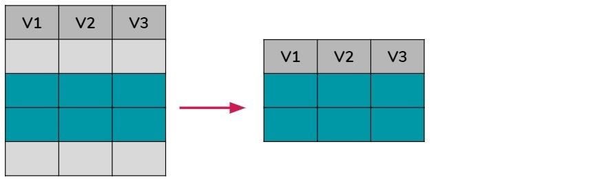

--- 
title: "BIG DATA URBANA"
author: "Angie Scetta"
date: "`r Sys.Date()`"
site: bookdown::bookdown_site
documentclass: book
bibliography: [book.bib, packages.bib]
biblio-style: apalike
link-citations: yes
subtitle: "Herramientas y Datos para conocer el Territorio"
lang: es
output:
  html_document:
    css: style.css
---

# INTRODUCCIÓN {-}

¡Hola a todos!

**¡Bienvenidos a BIG DATA URBANA!**

Estamos en un momento en que las Ciudades producen millones y millones de datos por segundo y hoy tenemos la posibilidad de aprovecharlos desde nuestra profesión para poder trabajar y tomar decisiones en base a evidencia real.

El objetivo del curso es presentar a los profesionales interesados en analizar diversas variables territoriales (sociodemográficas, mercado inmobiliario, actividad económica, transporte, movilidad, salud, educación, etc), la importancia de conocer herramientas analíticas que les permitan manipular y extraer conocimiento de grandes volúmenes de datos para tomar mejores decisiones a la hora de diagnosticar, comprender e intervenir el territorio.

El curso será práctico y se enseñarán los conocimientos básicos del lenguaje de programación R y del software libre RStudio, y su potencialidad para el análisis de datos urbanos.


A lo largo de 4 clases aplicaremos la herramienta a un ejemplo real, con el fin de analizar, describir, interpretar, visualizar y extraer conocimiento de datos existentes. El caso de estudio será el mercado inmobiliario en CABA y se utilizarán datos provenientes de fuentes públicas.

Será un curso de 4 clases de 3hs donde se estima un 90% práctico y un 10% teórico.

## Programa {-}

**Clase 1: CONOCER**

¿Qué es la Ciencia de Datos? ¿Cómo utilizar grandes volúmenes de datos para analizar dinámicas urbanas? ¿Qué datos existen? ¿Qué información contienen las bases de datos? ¿Cómo se estructuran?

Introducción a programación en lenguaje R y el software RStudio.

Para esta clase será necesario tener previamente instalado el lenguaje de programación R (https://cloud.r-project.org/), y la interfaz gráfica RStudio Desktop (https://rstudio.com/products/rstudio/download/).

En el caso de no poder instalar correctamente el programa, se recomienda utilizar RStudio Cloud (https://rstudio.cloud/).

**Clase 2: MANIPULAR**

Las funciones de *tidyverse* para interpretar, manipular y transformar los datos: Extraer información útil a partir de Seleccionar, Filtrar, Ordenar, Modificar, Resumir, Agrupar y Renombrar los datos.

**Clase 3: GRAFICAR**

¿Qué dicen los datos? ¿Cómo puedo facilitar la comprensión de la información?

Extraer conocimiento de los datos a partir de la visualización de los mismos. Comunicar resultados a partir de gráficos.

**Clase 4: MAPEAR**

¿Dónde se ubican los datos? ¿Cómo se distribuyen en el territorio? ¿Presentan algún patrón espacial?

Análisis espacial de los datos. Visualización e interpretación a partir de mapas.

<!--chapter:end:index.Rmd-->

---
title: "01-conocer.Rmd"
author: "Angie Scetta"
date: "Octubre 2020"
output: html_document
---

```{r include=FALSE}
knitr::opts_chunk$set(echo = TRUE, message = FALSE, warning = FALSE, dpi = 150)
```

# CONOCER

**¿Qué es R y RStudio?**

RStudio es una **interfaz libre y gratuita** que nos permite **explotar todo el potencial que tiene el lenguaje de programación R**.

R es un lenguaje que ofrece una gran variedad de funciones para realizar cálculos estadísticos y generar diversos gráficos a partir de los datos. Sin embargo, el gran potencial está en que, al ser libre y colaborativo, **constantemente los usuarios están actualizando y ampliando la cantidad de funciones que presenta**. Hoy en día podemos realizar desde operaciones básicas sobre los datos hasta aplicar algoritmos de inteligencia artificial.

A su vez, dentro de RStudio, hay diferentes formatos de archivos (RMarkdown, RScript, RNotebook, etc) que su elección depende del objetivo que tengamos. En nuestro caso, a lo largo del curso trabajaremos con el formato **RMarkdown**, un tipo de documento de RStudio que integra texto con código de R y nos permite generar informes a partir de los datos.

Empecemos de a poco:

Primero tenemos que crear un **nuevo proyecto y un nuevo RMarkdown**. Los pasos a seguir pueden encontrarlos en el siguiente tutorial: **https://rpubs.com/angiescetta/conociendo-R**

## Interfaz Gráfica de RStudio

Antes de seguir, analicemos un poco la **Interfaz Gráfica de RStudio**:


Tal como se ve en la imagen, podríamos dividir la interfaz en 4 partes/ventanas:

1. **Panel de Edición**

Este panel es en el que vamos a estar creando y modificando nuestro RMarkdown. Aquí también podría haber otro formato de archivo R, como por ejemplo R Script o R Notebook.

2. **Entorno de Variables**

En esta ventana iremos viendo todos los datos que hayamos cargado. Desde aquí también podremos importar o eliminar datos.

Desde la pestaña Historial podremos consultar el historial de comandos y funciones que fuimos utilizando en el Proyecto.

3. **Consola**

En la ventana inferior izquierda irá apareciendo todo lo que ejecutemos tanto desde el Panel de Edición como desde el Entorno de Variables, pero también podemos escribir líneas de código que queremos que se ejecuten y no queremos dejarlas escritas en el RMarkdown.

4. **Panel de Utilidades**

En la ventana inferior derecha se pueden ver varias cosas:

a. Files: El Directorio donde estamos trabajando.

b. Plots: Las visualizaciones/gráficos que se van generando.

c. Packages: Los paquetes de R disponibles.

d. Help: Una sección de ayuda donde podemos consultar información de las funciones.

e. Viewer: Un visor HTML para ver los gráficos interactivos o animados que hayamos hecho.

## Formato RMarkdown

**¿Para que sirve el formato RMawkdown?**

Este formato sirve para manipular datos y armar informes listos para presentar. Hay 2 formas de escribir en un RMarkdown:

1. **Texto** como el que estoy escribiendo ahora.

El RMarkdown tiene una sintaxis específica para poder dar formato al texto del informe final, por ejemplo si escribimos así:


Obtenemos los siguientes resultados:


2. **Bloques de código** (o "chunks") donde insertaremos nuestras líneas de código con el objetivo de manipular (analizar, modificar, visualizar) los datos. Esto es un chunk:


Y se inserta haciendo click en **Insert/R** o con el siguiente atajo en el teclado: **Ctrl + Shift + I**


## Nuestro primer dataset

A lo largo del curso vamos a trabajar con los datos de Properati, un portal web de compra, venta y alquiler de inmuebles en toda América Latina.
Estos datos son públicos y pueden encontrarlos en https://properati.com.ar/data.

En este caso, para facilitar la manipulación de la información, usaremos un set de datos (en formato csv) previamente procesado que contiene datos de propiedades publicadas en AMBA en Junio y Julio del 2020. Pueden descargarlo de https://data.world/angie-scetta/amba-properati.

*Recomendación: Al descargarlo, moverlo de la carpeta "Descargas" a una nueva carpeta llamada "data" dentro de la carpeta del Proyecto donde estén trabajando.*

Ahora si, manos a la obra! Para cargar el dataset pueden copiar la siguiente línea de código y pegarla dentro de un chunk:

```{r warning=FALSE}
datos_amba <- read.csv("data/amba_properati.csv")
```

Para entender la lógica detrás del chunk anterior pueden revisar este link: https://rpubs.com/angiescetta/importar-dataset

**Ahora conozcamos nuestro dataset**: Veamos como se estructura (cuantas filas y columnas tiene) y que información trae...

Para esto empezaremos utilizando `dim()`:

```{r}
dim(datos_amba)
```

Podemos ver que tenemos 14.929 registros/filas y 13 columnas. También podríamos ver esto por separado de la siguiente forma:

```{r}
ncol(datos_amba)
```
```{r}
nrow(datos_amba)
```

Pero **¿Qué información contienen esas 13 columnas?**

Esto podemos verlo con `names()`:

```{r}
names(datos_amba)
```
Bien, las columnas tienen fecha de publicación de la propiedad, provincia y partido donde se ubica, cantidad de ambientes, superficie total y superficie cubierta, precio publicado, tipo de moneda (ARS o USD), el título que el usuario escribió al publicar su propiedad, el tipo de propiedad, el tipo de operación, y finalmente la ubicación del inmueble con sus coordenadas: latitud y longitud.

Parece que cada fila/registro de la base corresponde a una propiedad publicada, pero veamos una pequeña muestra de la data con `head()` para estar seguros:

```{r}
head(datos_amba)
```
Y un **resumen estadístico de la información**:

```{r}
summary(datos_amba)
```

A priori, en este resumen podemos entender varias cosas de la data. Por ejemplo:

- Hay registros de propiedades publicadas entre **Junio (Min) y Julio (Max) 2020**.

- La **mayoría de las publicaciones son en CABA** (8.896 vs 6.033).

- El **Partido/Comuna que más aparece es la Comuna 14** (Barrio de Palermo), seguido por Tigre.

- De las 3 tipologías de propiedades, **lo que más hay es Departamentos**, seguido por Casas y por último PHs.

- Hay **más propiedades en Venta que en Alquiler** (11.678 vs 3.251).

Por último, investiguemos como es la **estructura de la data**, es decir que tipo de información tiene cada campo. Si bien algo ya nos imaginamos gracias al `summary()`, usemos `str()` para revisarlo:

```{r}
str(datos_amba)
```

Existen varios tipos de datos, pero en nuestro set nos encontramos con 3: integer (int), numeric (num) y Factor.

Ahora bien, ¿Qué significa eso?

- **Integer** son números enteros, es decir que el campo solo admite números sin decimales como por ejemplo cantidad de habitaciones de una propiedad.

- **Numeric** son números con decimales, como por ejemplo, latitud y longitud.

- **Factor** son categorías, por ejemplo Barrios, Partidos, Tipos de propiedades, etc.

Además del tipo de dato, con `str()` también podemos ver la cantidad de niveles que tienen las variables de tipo Factor. Por ejemplo, se observa que la columna provincia solo tiene 2 categorías posibles (CABA o AMBA), en cambio la columna partido tiene 50.

**Bonus Track**

¿Cómo hacemos si queremos ver la estructura o un resumen estadístico de una sola de las columnas del dataset? Para esto utilizamos el símbolo **$** de la siguiente forma:

```{r}
summary(datos_amba$property_type)
```

```{r}
str(datos_amba$property_type)
```

**Generemos nuestro primer HTML**

Por último, generemos nuestro primer reporte HTML para poder ver todos los resultados en un único informe. Para esto debemos hacer click en **Knit / Knit to HTML**:


**Próximos Pasos**

Acá concluye la primer clase, pero los invito a que repliquen lo realizado con algún otro dataset que les interese. Pueden descargar datos de diversos portales abiertos como por ejemplo: 

- Portal de Datos Abiertos de Argentina: https://datos.gob.ar/

- Portal de Datos Abiertos de CABA: https://data.buenosaires.gob.ar/

- Portal de Datos Abiertos de PBA: https://catalogo.datos.gba.gob.ar/

- O de cualquier otro portal de datos que conozcan o encuentren!

<!--chapter:end:01-conocer.Rmd-->

# MANIPULAR

Ahora que ya sabemos abrir un dataset y conocer que información tiene, vamos a aprender a manipular y transformar los datos. Para esto vamos a trabajar con uno de los paquetes más usados y más útiles de R que se llama `tidyverse`.

Pero, **¿Qué es un paquete?**

Cuando instalamos R ya viene con múltiples funciones básicas para manipular datos, sin embargo el potencial de R surge con la posibilidad de incorporar constantemente nuevas funciones que nos permitan realizar nuevas tareas o mejorar el resultado de las ya existentes.

Estos grupos de funciones son a los que llamamos paquetes o packages y para poder utilizarlos es necesario **instalarlos por única vez en la computadora**, y luego **activarlos cada vez que vayamos a usarlos**.

Comencemos instalándolo. Esto podemos hacerlo manualmente en Tools/Install packages:


O directamente escribiendo `install.packages()` adentro de un chunk:

```{r}
#install.packages("tidyverse")
```

Una vez que instalamos el paquete, no vamos a tener que volver a hacerlo. Solamente vamos a tener que "activarlo" cada vez que queramos usarlo. Esta activación se hace con `library()` así:

```{r}
library(tidyverse)
```

Ahora volvamos a cargar nuestro dataset (el mismo de la clase anterior):

```{r}
datos_amba <- read.csv("data/amba_properati.csv")
```

A continuación veremos como el paquete `tidyverse` nos va a permitir manipular nuestros datos a partir de las funciones: **filtrar**, **modificar**,  **seleccionar**, **ordenar**, **renombrar**, **resumir** y **agrupar**.

Aprender a utilizar todas estas funciones es muy importante ya que la **comprensión, transformación y limpieza de los datos** es la etapa que más tiempo nos llevará a la hora de encarar cualquier proyecto de Ciencia de Datos.

## Filtrar

Como su nombre lo indica, esta función hace referencia a realizar un filtro determinado sobre los registros/filas de toda la base de datos, es decir, quedarnos solo con las filas que cumplan cierta condición establecida. Gráficamente se vería como algo así:



Esto nos será muy útil si por algún motivo queremos dejar de lado registros y utilizar solo una parte de la base. Por ejemplo, en el caso de nuestro dataset, que ya vimos que incluye datos de AMBA y CABA, podríamos filtrar la data y quedarnos solo con los registros ubicados en CABA:

```{r}
filtro <- filter(datos_amba, provincia=="CABA")

head(filtro)
```

O los del mes de Julio 2020:

```{r}
filtro <- filter(datos_amba, created_on==202007)

head(filtro)
```

Nótese que para filtrar bajo la condición de "igual" utilicé "==", pero también podría haber utilizado otras condiciones como:

- **A==B**     -> A igual a B
- **A!=B**     -> A diferente a B
- **A<B**      -> A menor a B
- **A<=B**     -> A menor o igual a B
- **A>B**      -> A mayor a B
- **A>=B**     -> A mayor o igual a B
- **is.na(A)** -> A tiene valor nulo (NA)
- **!is.na(A)**-> A no tiene valor nulo (NA)
- **A%in%B**   -> A incluye el valor B
- **!(A%in%B)**-> A no incluye el valor de B

Entonces, por ejemplo si quiero quedarme solo con las propiedades que tienen una superficie cubierta mayor o igual a 75m2 debería escribirlo así:

```{r}
filtro <- filter(datos_amba, surface_covered>=75)

head(filtro)
```

O si quiero eliminar los registros que corresponden a departamentos debería hacer el siguiente chunk:

```{r}
filtro <- filter(datos_amba, property_type!="Departamento")

head(filtro)
```

Si queremos filtrar todas las propiedades ubicadas en 3 partidos diferentes como por ejempo La Plata, General San Martín y La Matanza debemos utilizar %in% de la siguiente forma:

```{r}
filtro <- filter(datos_amba, partido %in% c("La Plata", "General San Martín", "La Matanza"))

head(filtro)
```

En cambio, si queremos filtrar todas las propiedades que no estén ubicadas en 3 partidos diferentes como por ejempo La Plata, General San Martín y La Matanza debemos utilizar ! + %in% de la siguiente forma:

```{r}
filtro <- filter(datos_amba, !(partido %in% c("La Plata", "General San Martín", "La Matanza")))

head(filtro)
```

Pero esto no es todo, ¿Cómo hago si quiero filtrar por **2 o más condiciones a la vez**?

En este caso debemos utilizar los siguientes operadores lógicos:

- condición 1 **&** condición 2        -> se cumplen ambas condiciones a la vez
- condición 1 **|** condición 2        -> se cumple una u otra de las condiciones
- condición 1 **& !** condición 2      -> se cumple la condición 1 pero no la condición 2
- **!**condición 1 **&** condición 2   -> no se cumple la condición 1 pero si la condición 2
- **!**(condición 1 **&** condición 2) -> no se cumple ninguna de las 2 condiciones 

Por ejemplo, si queremos filtrar todos los registros pertenecientes a la Comuna 5 y a la Comuna 13:

```{r}
filtro <- filter(datos_amba, partido=="Comuna 5" & partido=="Comuna 13")

head(filtro)
```

El resultado es 0 porque un registro no puede pertenecer a ambas comunas al mismo tiempo, sin embargo si queremos filtrar aquellos que pertenecen a una u otra podemos hacerlo así:

```{r}
filtro <- filter(datos_amba, partido=="Comuna 5" | partido=="Comuna 13")

head(filtro)
```

También podemos quedarnos con aquellas propiedades que estén en alquiler y que tengan más de 50m2:

```{r}
filtro <- filter(datos_amba, operation_type=="Alquiler" & surface_covered>=50)

head(filtro)
```

O con aquellas propiedades que se ubiquen en la Comuna 12, 13 o 14 y que no sean monoambientes:

```{r}
filtro <- filter(datos_amba, partido %in% c("Comuna 14", "Comuna 13", "Comuna 12") & ! rooms==1)

head(filtro)
```

¡Y así se pueden hacer todas las combinaciones de filtros que querramos!

¿Y si en vez de quitar filas queremos quitar columnas? Bueno, aquí tenemos que usar la función de "seleccionar" que veremos a continuación.

## Seleccionar

La función `select()` nos permite elegir u ordenar columnas de nuestro dataset. Esto se puede hacer indicando los nombres completos de las columnas, palabras que contienen, o la letra con la que empiezan o terminan.

Graficamente sería algo así:


Por ejemplo, de la siguiente forma podríamos quedarnos solo con las columnas created_on, provincia, price y currency:

```{r}
seleccion <- select(datos_amba, created_on, provincia, price, currency)

head(seleccion)
```

También podríamos elegir que columna/s no queremos tener más en nuestro dataset agregando un "-" antes de su nombre:

```{r}
seleccion <- select(datos_amba, -title)

head(seleccion)
```

Con ":" podríamos indicar que queremos seleccionar un rango de columnas. Desde price hasta operation_type:

```{r}
seleccion <- select(datos_amba, price:operation_type)

head(seleccion)
```

O con las que ocupan de la posición 7 a la 10:

```{r}
seleccion <- select(datos_amba, 7:10)

head(seleccion)
```

O agregando un "-" adelante podríamos quedarnos con aquellas que no ocupan de la posición 7 a 10:

```{r}
seleccion <- select(datos_amba, -(7:10))

head(seleccion)
```

Otra opción es seleccionar columnas de acuerdo a la primer letra de los nombres. Por ejemplo aquellas que comienzan con la letra "p":

```{r}
seleccion <- select(datos_amba, starts_with("p"))

head(seleccion)
```

O aquellas que sus nombres terminan con la letra "e":

```{r}
seleccion <- select(datos_amba, ends_with("e"))

head(seleccion)
```

O que sus nombres contengan la palabra "surface":

```{r}
seleccion <- select(datos_amba, contains("surface"))

head(seleccion)
```

## Modificar

Ahora veamos como mutar nuestro dataset agregando nuevas columnas o cambiando el contenido de las existentes. Gráficamente sería algo así:


Aprovechando que tenemos los datos del precio total (price) y superficie cubierta (surface_covered) de cada una de las propiedades, agreguemos una nueva columna a nuestro dataset que incluya el valor del m2:

```{r}
modificar <- mutate(datos_amba, price_m2=price/surface_covered)

head(modificar)
```

Si queremos redondear el resultado obtenido, principalmente cuando es una división y por default nos pone varios decimales, tenemos que usar `round()` y asignar la cantidad de decimales deseados, en este caso usaré 2:

```{r}
modificar <- mutate(datos_amba, price_m2=round(price/surface_covered, 2))

head(modificar)
```

Como verán, para hacer cálculos entre columnas numéricas podemos utilizar:

- **A/B** A dividido B
- **A*B** A multiplicado por B
- **A+B** Suma de A y B
- **A-B** Resta de A menos B

También podríamos agregar una columna que refleje un cálculo entre una columna existente y un valor extra, por ejemplo pasemos la superficie total de m2 a cm2:

```{r}
modificar <- mutate(datos_amba, surface_total_cm2=surface_total*10000)

head(modificar)
```

Dejando de lado los cálculos, otra posibilidad que tenemos es separar el contenido de una columna en 2, por ejemplo dividamos en año y mes la data que aparece en created_on. Para esto utilizaremos `substr()`:

```{r}
modificar <- mutate(datos_amba,
                    year = substr(created_on, 1, 4),
                    month = substr(created_on, 5, 6))

head(modificar)
```

Otra aplicación que tiene `mutate()` es la de agregar columnas con algun contenido que elijamos nosotros, como por ejemplo sumemos una nueva columna que indique la fuente de donde descargamos toda esta información:

```{r}
modificar <- mutate(datos_amba, fuente="Properati")

head(modificar)
```

Ahora veamos como modificar el tipo de dato dentro de una columna:

```{r}
class(datos_amba$title)
```

Vemos que la variable "title" es de tipo factor, así que cambiemos su formato a character:

```{r}
modificar <- mutate(datos_amba, title=as.character(title))

class(modificar$title)
```

En el ejemplo anterior utilizamos `as.character()` pero si quisiesemos convertir una variable a factor utilizariamos `as.factor()`, a numérica `as.numeric()` o a número entero `as.integer()`,

Por último, veamos como unir 2 columnas de texto en una con `paste()`:

```{r}
modificar <- mutate(datos_amba, prov_partido=paste(provincia, partido, sep="_"))

head(modificar)
```

## Ordenar

Esta función nos permitirá ordenar las columnas en orden ascendente o descendente como se ve a continuación:


Probemos ordenar las filas de nuestro data frame en función de los valores de una o más columnas. Por defecto se ordena en forma ascendente:

```{r}
ordenar <- arrange(datos_amba, surface_total)

head(ordenar)
```

Pero si queremos ordenar en forma descendente debemos aclararlo con `desc()`:

```{r}
ordenar <- arrange(datos_amba, desc(surface_total))

head(ordenar)
```

También podemos ordenar por 2 o más columnas. En este caso, R priorizará ordenar la primera, luego la segunda, y asi sucesivamente. Veamos un ejemplo:

```{r}
ordenar <- arrange(datos_amba, partido, rooms)

head(ordenar)
```

```{r}
ordenar <- arrange(datos_amba, partido, desc(rooms))

head(ordenar)
```

## Renombrar

Ahora veamos como cambiar los nombres a una o más columnas existentes en nuestro dataset:


Empecemos cambiando el nombre de la variable "rooms" por "ambientes":

```{r}
renombrar <- rename(datos_amba, ambientes=rooms)

head(renombrar)
```

Como habrán notado, primero hay que poner el nombre de la nueva columna y luego el de la columna actual. Esto es muy importante, porque si lo hacemos al revés nos dará un error.

Ahora veamos un ejemplo y cambiemos los nombres de 3 columnas:

```{r}
renombrar <- rename(datos_amba, ambientes=rooms, m2_cubierto=surface_covered, m2_total=surface_total)

head(renombrar)
```

## Resumir y Agrupar

Esta función es súper útil cuando manipulamos datos ya que nos permitirá realizar resumenes/sumarios de la data completa, obteniendo por ejemplo valores promedio, máximos o mínimos de una o más columnas.


Probemos calculando la mediana de todos los valores que aparecen en la columna surface_covered:

```{r}
summarise(datos_amba, surface_covered=median(surface_covered))
```

O calculemos un promedio de toda la columna surface_total:

```{r}
summarise(datos_amba, surface_covered=mean(surface_covered))
```

También podemos averiguar el valor máximo o mínimo de alguna variable:

```{r}
summarise(datos_amba, surface_covered=max(rooms))
```

```{r}
summarise(datos_amba, surface_covered=min(rooms))
```

Como verán, esta función resulta útil para ver valores agregados de toda la base, sin embargo, también podemos agrupar los datos previo a calular los resumenes, y así obtener resumenes por agrupaciones en vez de uno solo para toda la base. Para esto vamos a utilizar `summarise()` junto a `group_by()`. Veamos un ejemplo:

- Primero agrupemos los datos por la variable "operation_type".

- Luego calculemos el promedio de superficie cubierta sobre la agrupación realizada previamente.

```{r}
agrupar <- group_by(datos_amba, operation_type)

resumir <- summarise(agrupar, surface_covered=mean(surface_covered))

head(resumir)
```

Con la agrupación y el resumen podemos ver que la superficie cubierta promedio de las propiedades en alquiler es 72,93m2 y la de las propiedades en venta es 97,28m2.

Probemos agrupando por 3 columnas:

```{r}
agrupar <- group_by(datos_amba, operation_type, currency)

resumir <- summarise(agrupar, price_m2=mean(price/surface_covered))

head(resumir)
```

El valor del m2 promedio para las propiedades en Alquiler es de 520 $ARS mientras que para las propiedaes en venta es de 2.689 USD. Sin embargo, está claro que en el valor de CABA y GBA es diferente, así que calculemos el valor del m2 promedio para cada uno:

```{r}
agrupar <- group_by(datos_amba, operation_type, currency, provincia)

resumir <- summarise(agrupar, rooms=mean(price/surface_covered))

head(resumir)
```

Se ve claramente que hay una diferencia entre CABA y GBA, siendo CABA más caro para ambos tipos de operación. Por último probemos desagregando esta información por partido:

```{r}
agrupar <- group_by(datos_amba, operation_type, currency, partido)

resumir <- summarise(agrupar, price_m2=mean(price/surface_covered))

head(resumir)
```

## Concatenar funciones (%>%)

Llegamos al final de la clase, ya vimos varias funciones por separado, pero ¿Qué pasa si queremos aplicarlas todas a la vez? ¿Cómo podemos hacerlo?

En este caso debemos usar el operador pipe (%>%) **Ctrl+Shift+M** que sirve para encadenar funciones, y en vez de realizar una por una, poder realizar todas juntas.

Veamos algunos ejemplos:

Imaginemos que queremos calcular por mes y para cada provincia (CABA y GBA) cuantas propiedades hubo en venta, con que valor total promedio, con que valor del m2 promedio y con que superficie promedio. Así lo tenemos que hacer según lo aprendido hasta ahora:

```{r}
concatenar <- filter(datos_amba, operation_type=="Venta")

concatenar <- select(concatenar, created_on, provincia, surface_covered, price)

concatenar <- group_by(concatenar, created_on, provincia)

concatenar <- summarise(concatenar, cantidad=n(),
                        price=mean(price),
                        surface_covered=mean(surface_covered),
                        price_m2=price/surface_covered)

head(concatenar)
```

Y así lo deberíamos hacer con pipe %>%:

```{r}
concatenar <- datos_amba %>%
  filter(operation_type=="Venta") %>%
  select(created_on, provincia, surface_covered, price) %>%
  group_by(created_on, provincia) %>%
  summarise(cantidad=n(),
            price=mean(price),
            surface_covered=mean(surface_covered),
            price_m2=price/surface_covered)

head(concatenar)
```

A partir de la agrupación y resumen por ejemplo podemos ver que:

- En ambos meses, en CABA hubo mayor cantidad de propiedades en venta.
- En ambos meses, la superficie cubierta de las propiedades en venta en GBA son mayores que las de CABA.
- En ambos meses el valor promedio del m2 es más alto en CABA que ne GBA.
- En ambas zonas (CABA y GBA), entre Junio y Julio 2020 hubo una caída en la cantidad de propiedades publicadas y en el valor promedio del m2.

Como verán, en ambos casos llegamos al mismo resultado, pero sin dudas, la segunda opción es la recomendable porque nos ahorramos varias líneas de código y resultados intermedios.

<!--chapter:end:02-manipular.Rmd-->

# GRAFICAR

El paquete `tidyverse` incluye diversos paquetes, entre los que se encuentra `ggplot2`, que nos permite realizar diferentes tipos de gráficos a partir de nuestros datos.

Hasta acá ya sabemos abrir, conocer, manipular y transformar un dataset, así que ahora nos enfocaremos en el **desarrollo de visualizaciones** que nos permitirán comunicar de forma gráfica lo que dicen nuestros datos.

En la estructura del código necesario para realizar un gráfico con `ggplot2` hay que determinar lo siguiente:

- **Dataset a utilizar**: hay que indicar el dataset al inicio del código en **ggplot(dataset)**.
- **Tipo de Gráfico** a realizar: puede ser de puntos, barras, líneas, áreas, matriz, histograma, densidad, etc. Estos elementos funcionan como "capas" ya que pueden utilizarse más de uno a la vez en un mismo gráfico y sus códigos se escriben **geom_hist()**, **geom_tile()**, **geom_bar()**, etc.
- **Atributos Estéticos** que dependen de una o más columnas del dataset: variables a utilizar en ejes x e y, colores, tamaños, formas, transparencias, etc. Siempre se asignan dentro de **aes()**.
- **Etiquetas** que ayudan a la interpretación de las visualizaciones. Estas son: títulos, subtítulos, leyendas, etc. Se asignan dentro de **labs()**.
- **Facetas** a utilizar: de acuerdo a alguna columna del dataset dividen el gráfico manteniendo las escalas. Esto es opcional y se hace con **facet_grid()**.
- **Temas** que permiten elegir la estética general del gráfico (color de fondo, tamaño de márgenes, etc). Algunos son **theme_void()**, **theme_dark()**, etc.

A continuación seguiremos trabajando con los datos de Properati de Junio y Julio 2020 en AMBA y desarrollaremos diferentes visualizaciones que sinteticen y comuniquen la información que contiene.

En particular, veremos como representar gráficamente lo siguiente:

- Distribución de una variable continua
- Distribución de valores continuos asociados a una variable categórica
- Relación entre variables continuas
- Relación entre variables categóricas
- Relación entre una variable continua y una categórica

Empecemos activando la librería `tidyverse`:

```{r}
library(tidyverse)
```

Y volvamos a cargar nuestro dataset:

```{r}
datos_amba <- read.csv("data/amba_properati.csv")
```

## Histograma

**Distribución de una variable continua**

Los histogramas muestran gráficamente, a partir de barras, la distribución de una variable continua, es decir la frecuencia con la que aparece cada valor numérico en una determinada columna del dataset. En el eje X se representa la variable continua y en el eje Y la frecuencia de la misma.

Para generar este tipo de visualización utilizaremos `ggplot()` + `geom_histogram()`. Veamos por ejemplo como se distribuyen las superficies cubiertas (surface_covered) de las propiedades publicadas:

```{r}
ggplot(datos_amba)+
  geom_histogram(aes(x=surface_covered))
```

El eje X muestra la cantidad de m2 cubiertos que tienen las propiedades publicadas y el eje Y la cantidad de veces que aparece cada superficie. Por lo tanto, podemos ver que hay muchas propiedades con "poca" superficie cubierta y pocas propiedades con "mucha" superficie cubierta.

Para facilitar la interpretación, podemos modificar el ancho de las barras (bins) que por defecto el valor es 30. Probemos con bins=75:

```{r}
ggplot(datos_amba)+
  geom_histogram(aes(x=surface_covered), bins=75)
```

¿Notan el cambio? El eje Y disminuyó porque los conteos se agruparon en intervalos más pequeños sobre el eje X.

Podemos observar que hay más propiedades por debajo de los 100m2 cubiertos que por encima, y que la mayor cantidad de observaciones se ubica alrededor de los 50m2. También podemos detectar algunos outliers que tienen alrededor de 800m2.

Pero desagreguemos aún más nuestros datos y sumemos una variable categórica (tipo de operación) que nos permita facetar/dividir el gráfico. Para esto utilizaremos `facet_grid()`:

```{r}
ggplot(datos_amba)+
  geom_histogram(aes(x=surface_covered), bins=75) +
  facet_grid(operation_type~.)
```

La tendencia se mantiene similar en ambos casos, con una mayoría de propiedades de aproximadamente 50m2 cubiertos. Sin embargo, se detecta una gran diferencia en la cantidad de propiedades publicadas para cada tipo de operación.

Incorporemos una variable más (provincia) que nos permita comprender si los comportamientos de la variable surface_covered cambian entre CABA y PBA. En este caso la agregaremos como un color de relleno (fill):

```{r}
ggplot(datos_amba)+
  geom_histogram(aes(x=surface_covered, fill=provincia), bins=75)+
  facet_grid(operation_type~.)
```

Podemos ver que tanto en CABA como en AMBA, los comportamientos de la variable analizada son similares.

Por último probemos sumar una variable más dentro del facetado (fecha de publicación), agreguemos etiquetas (labs) y elijamos los colores del gráfico (scale_fill y theme).

Cabe destacar que hay 2 tipos de escalas de color:

- Las ya establecidas (listas para usar): Brewer, Viridis. Recomiendo utilizar estas que en `ggplot2` las van a encontrar como scale_fill_viridis_c(), scale_fill_brewer() y demás variantes.

- Las personalizadas, donde nosotros elegimos todos los colores: Gradiente (scale_fill_gradient()), Manual (scale_fill_manual())
*Para obtener un listado de colores pueden ver este link: http://www.stat.columbia.edu/~tzheng/files/Rcolor.pdf*

```{r}
ggplot(datos_amba)+
  geom_histogram(aes(x=surface_covered, fill=provincia), bins=75)+
  facet_grid(created_on~operation_type)+
  labs(title="M2 cubiertos según Zona, Operación y Fecha de Publicación",
       fill="Zona",
       x="Superficie cubierta (M2)",
       y="Cantidad",
       caption="Fuente: Properati Junio y Julio 2020")+
  scale_fill_manual(values = c("goldenrod2", "indianred2"))+
  theme_light()
```

En el histograma anterior se puede ver que si bien en ambos meses las distribuciones se mantienen, en Junio hay mayor cantidad de publicaciones que en Julio.

## Gráfico de Densidad

**Distribución de una variable continua**

Este tipo de gráfico cumple la misma función que el Histograma, pero se caracteriza por generar una versión más "suavizada" en la que muestra la densidad de kernel a lo largo de toda la variable continua y no conteos por bins. Estos gráficos nos permiten ver cuales son los intervalos de la variable continua donde hay mayor probabilidad de encontrar registros.

Para generar esta visualización utilizaremos `ggplot()` + `geom_density()`. Veamos por ejemplo como se distribuyen los valores por m2 (price/surface_covered) de las propiedades publicadas:

```{r}
ggplot(datos_amba)+
  geom_density(aes(x=price/surface_covered))
```

En primer lugar, tenemos los valores del eje Y en notación científica. Si queremos evitar esto es necesario que escribamos la siguiente línea de código:

```{r}
options(scipen=999)
```

Y ahora si, ejecutar nuevamente el chunk anterior:

```{r}
ggplot(datos_amba)+
  geom_density(aes(x=price/surface_covered))
```

En el gráfico se ven 2 "picos" muy pronunciados que indican en que partes del intervalo se concentran los valores. Esto podría deberse a que estamos trabajando con ambos tipos de operación (Alquiler y Venta), y como todos sabemos, los valores del m2 de ambos son muy diferentes, tanto por la moneda (ARS vs USD) como por los montos.
Por lo tanto, es muy probable que cada uno de esos "picos" se corresponda al valor del m2 de cada una de las operaciones. Para poder desemascarar esto recurramos nuevamente al facetado:

```{r}
ggplot(datos_amba)+
  geom_density(aes(x=price/surface_covered), fill="gray") +
  facet_grid(operation_type~.)
```

Las operaciones tienen una distribución del valor del m2 muy diferentes entre sí. Se ve muy claro que los alquileres tienen un rango de precios que va desde 300 a 500$ARS aprox mientras que las ventas distribuyen sus publicaciones a lo largo de un rango bastante mayor entre 1.500USD y 3.500USD aproximadamente.

Pero como los precios también deberían variar bastante de acuerdo a la zona geográfica, probemos agregar una variable categórica más que nos ayude a diferenciar CABA de GBA:

```{r}
ggplot(datos_amba)+
  geom_density(aes(x=price/surface_covered, fill=provincia), alpha=0.5) +
  facet_grid(operation_type~.)
```

Obviamente para cada partido, localidad y calle específica los valores van a variar, pero a simple vista podríamos notar que en ambos casos el valor del m2 de la mayoría de propiedades es mayor en CABA.

Ahora analicemos como se comporta el valor del m2 de venta según el tipo de propiedad en CABA y GBA y aprovechemos para agregar etiquetas y colores a nuestro gráfico:

```{r}
ggplot(datos_amba %>%
         filter(operation_type=="Venta"))+
  geom_density(aes(x=price/surface_covered, fill=provincia), alpha=0.5) +
  facet_grid(property_type~.)+
  labs(title="Valor del m2 en Venta según Zona y Tipo de Propiedad",
       fill="Zona",
       x="Valor m2",
       y="Densidad",
       caption="Fuente: Properati Junio y Julio 2020")+
  scale_fill_manual(values = c("goldenrod2", "indianred2"))+
  theme_light()
```

En las 3 tipologías de vivienda los valores del m2 que predominan en CABA son mayores a los de GBA.

Y ahora elijamos 3 partidos para comparar:

```{r}
ggplot(datos_amba %>%
         filter(operation_type=="Venta" & partido==c("Vicente López", "La Matanza", "La Plata")))+
  geom_density(aes(x=price/surface_covered, fill=partido), alpha=0.5) +
  facet_grid(property_type~.)+
  labs(title="Valor del m2 en Venta por Partido y Tipo de Propiedad",
       fill="Zona",
       x="Valor m2",
       y="Densidad",
       caption="Fuente: Properati Junio y Julio 2020")+
  theme_light()
```

En las 3 tipologías se ve que Vicente López tiene los precios más elevados por m2, y a su vez que los departamentos de La Matanza superan en precio a los de La Plata. Sin embargo, para casas y PHs, La Matanza y La Plata tienen precios muy similares.

## Gráfico de Cajas

**Distribución de valores continuos asociados a una variable categórica**

Un Gráfico de Cajas sirve para comparar la distribución y tendencia central de varias categorías de una variable.

Veamos como luce un gráfico de este tipo:


Para cumplir con el objetivo de analizar la distribución de una determinada muestra de datos, **la visualización distribuye los datos en cuartiles: Q1, Q2 y Q3**. Cabe destacar que, los cuartiles son los valores que dividen a la muestra (cantidad de registros) en 4 partes iguales.

**Q1**: El primer cuartil está representado por el mayor valor incluido en el 1/4 más bajo. Es decir que, el 25% de la muestra de datos es menor que este valor.

**Q2**: El segundo cuartil está representado por el mayor valor incluido en el 2/4. Es decir que, el 50% de la muestra de datos es menor que este valor. Este valor indica la **mediana de la serie**.

**Q3**: El tercer cuartil está representado por el mayor valor incluido en el 3/4. Es decir que, el 75% de la muestra de datos es menor que este valor.

En este gráfico también pueden aparecer **outliers**, es decir valores extremos que haya dentro de los conjuntos de datos.

Para generar esta visualización utilizaremos `ggplot()` + `geom_boxplot()`. Veamos por ejemplo como se distribuyen los valores por m2 (price/surface_covered) por zona:

```{r}
ggplot(datos_amba) +
  geom_boxplot(aes(x = provincia, y = price/surface_covered))
```

En el gráfico anterior podemos observar que la mediana del valor del m2 en CABA es superior al de GBA, pero estamos mezclando datos de ambos tipos de operaciones (alquileres y ventas), lo cual no es correcto. Para mejorar este aspecto facetemos el gráfico según tipo de operación:

```{r}
ggplot(datos_amba) +
  geom_boxplot(aes(x = provincia, y = price/surface_covered)) +
  facet_grid(~operation_type)
```

Si bien los valores que se manejan en cada operación son muy diferentes entre sí, en ambos casos se mantiene que la **mediana del valor del m2 en CABA es superior que en GBA**. Sin embargo, como las 2 escalas son muy diferentes, casi no se ven las cajas correspondientes a los alquileres.

Hagamos un filtro por Alquileres para ver mejor que ocurre ahí:

```{r}
ggplot(datos_amba %>%
         filter(operation_type=="Alquiler")) +
  geom_boxplot(aes(x = provincia, y = price/surface_covered, fill=provincia), show.legend = FALSE) +
  labs(title = "Distribución del valor del m2 de Alquileres en CABA y GBA",
       subtitle = "Publicaciones de Junio y Julio 2020",
       y = "Valor del m2",
       x = "Zona",
       caption = "Fuente: Properati")
```

La mediana de CABA está por encima pero claramente dentro de CABA hay muchas diferencias entre Comunas. Grafiquemos esto con datos de CABA desagregados por Comuna:

```{r}
ggplot(datos_amba %>%
         filter(operation_type=="Alquiler" & provincia=="CABA")) +
  geom_boxplot(aes(x = partido, y = price/surface_covered, fill=partido), show.legend = FALSE) +
  labs(title = "Distribución del valor del m2 de Alquileres en CABA y GBA",
       subtitle = "Publicaciones de Junio y Julio 2020",
       y = "Valor del m2",
       x = "Comuna",
       caption = "Fuente: Properati")+
  coord_flip()
```

Se ve que:

- La Comuna 14 y la Comuna 1 tienen una mediana muy similar en el valor del m2 (el más alto de CABA).
- La Comuna 14 presenta la mayor cantidad de outliers, motivo por el cual al calcular promedios siempre está por encima de la Comuna 1.
- La Comuna 1 presenta la mayor variación en el valor del m2: va desde 200ARS hasta 1500ARS aprox. Esto se puede deber a la heterogeneidad de barrios que contiene.
- La Comuna 8 tiene muy pocas observaciones.
- La Comuna 10 presenta el menor valor del m2.

Veamos que pasa si filtramos solo PBA y lo desagregamos por Partido:

```{r}
ggplot(datos_amba %>%
         filter(operation_type=="Alquiler" & provincia=="GBA")) +
  geom_boxplot(aes(x = partido, y = price/surface_covered, fill=partido), show.legend = FALSE) +
  labs(title = "Distribución del valor del m2 de Alquileres en CABA y GBA",
       subtitle = "Publicaciones de Junio y Julio 2020",
       y = "Valor del m2",
       x = "Partido",
       caption = "Fuente: Properati")+
  coord_flip()
```

Acá vemos que:

- Vicente López presenta la mayor variación en el valor del m2 y la mediana más alta de los partidos incluidos en la base.
- Presidente Perón es el partido de la base con menor valor del m2.

Este análisis también podríamos hacerlo comparando entre partidos específicos y diferenciando por mes de publicación, por ejemplo:

```{r}
ggplot(datos_amba %>%
         filter(operation_type=="Alquiler" & partido==c("Vicente López", "La Matanza", "La Plata"))) +
  geom_boxplot(aes(x = partido, y = price/surface_covered, fill=partido), show.legend = FALSE) +
  labs(title = "Distribución del valor del m2 de CABA y GBA",
       subtitle = "Junio y Julio 2020",
       y = "Valor del m2",
       x = "Partido",
       color = "Partido",
       caption = "Fuente: Properati")+
  facet_grid(created_on~.)+
  scale_fill_brewer(palette = "Set3")+
  coord_flip()
```

## Gráfico de Dispersión

**Relación entre variables numéricas**

Ahora veamos el clásico gráfico de puntos o scatter plot que muestra la dispersión que existe entre 2 variables numéricas representadas en los 2 ejes X e Y, y que permite identificar si existe o no una relación entre ambas.

Veamos por ejemplo, si existe relación entre la superficie cubierta (surface_covered) y el precio total (price) de las propiedades:

```{r}
ggplot(datos_amba)+
  geom_point(aes(x=surface_covered, y=price))
```

Tiene sentido, a mayor superficie cubierta, mayor valor. Pero veamos esto desagregado entre tipos de operaciones a ver que pasa:

```{r}
ggplot(datos_amba)+
  geom_point(aes(x=surface_covered, y=price, color=operation_type), alpha=0.5)
```

A los gráficos de dispersión también se les puede agregar una tercer variable categórica o numérica que puede verse reflejada en la estética de los puntos (color, forma o tamaño).

Agreguemos una tercer variable (categórica) a nuestro gráfico: la provincia

```{r}
ggplot(datos_amba)+
  geom_point(aes(x=surface_covered, y=price, color=operation_type), alpha=0.5) +
  facet_grid(provincia~.)
```

Podemos ver que en GBA no crece tan rápido la relación como en CABA.

Quedemonos solo con las ventas y agreguemos una tercer variable numérica: el valor del m2

```{r}
ggplot(datos_amba %>%
         filter(operation_type=="Venta"))+
  geom_point(aes(x=surface_covered, y=price, color=price/surface_covered), alpha=0.5) +
  facet_grid(provincia~.) +
  scale_color_viridis_c(option="magma")
```

Ahora aprovechemos que tenemos longitud y latitud de cada registro y hagamos un gráfico de puntos que nos permita ver la relación entre ambas variables:

```{r}
ggplot()+
  geom_point(data=datos_amba, aes(x=lon, y=lat))
```

¿A qué se parece? ¿Tiene forma de AMBA? Probemos coloreando según la variable provincia.

```{r}
ggplot()+
  geom_point(data=datos_amba, aes(x=lon, y=lat, color=provincia))
```

## Gráfico de Matriz

**Relación entre variables categóricas**

Este tipo de gráfico representa un mapa de calor bidimensional que muestra la frecuencia que existe entre 2 variables dentro de la base de datos.

Para poder desarrollar la visualización es necesario elegir 3 variables:

**x**: variable a ubicar en el eje X

**y**: variable a ubicar en el eje Y

**fill**: valor numérico que será representado a partir de los colores

Veamos un ejemplo relacionando el partido y la cantidad de ambientes:

```{r}
ggplot(datos_amba %>%
              group_by(partido, rooms) %>%
              summarise(cantidad=n())) + 
  geom_tile(aes(x = partido,
                y = as.factor(rooms),
                fill = cantidad))
```

Mejoremos con `coord_flip()` el aspecto de la visualización:

```{r}
ggplot(datos_amba %>%
              group_by(partido, rooms) %>%
              summarise(cantidad=n())) + 
  geom_tile(aes(x = partido,
                y = as.factor(rooms),
                fill = cantidad)) +
  scale_fill_viridis_c() +
  coord_flip()
```

Se puede ver por ejemplo que la relación Comuna 14 + 2 ambientes, y Comuna 14 + 3 ambientes es la que más se repite (más de 600 veces cada una). Filtremos solo CABA:

```{r}
ggplot(datos_amba %>%
              filter(provincia=="CABA") %>%
              group_by(partido, rooms) %>%
              summarise(cantidad=n())) + 
  geom_tile(aes(x = as.factor(partido),
                y = as.factor(rooms),
                fill = cantidad)) +
  scale_fill_viridis_c() +
  coord_flip()
```

Obviamente se sigue viendo lo mismo de la Comuna 14 pero también se empieza a ver como la Comuna 13 y 15 también aparecen mucho con propiedades de 2 y 3 ambientes. Veamos el caso de GBA:

```{r}
ggplot(datos_amba %>%
              filter(provincia=="GBA") %>%
              group_by(partido, rooms) %>%
              summarise(cantidad=n())) + 
  geom_tile(aes(x = as.factor(partido),
                y = as.factor(rooms),
                fill = cantidad)) +
  scale_fill_viridis_c() +
  coord_flip()
```

En GBA la mayor cantidad se ve en Tigre con 3 ambientes, seguida por 2 y 4. También hay varias propiedades de 2 y 3 ambientes en La Plata.

## Gráfico de Barras

**Relación entre variable numérica y categórica**

El gráfico de barras representa, a partir de la longitud de las barras, el valor numérico (eje Y) asociado a cada entidad de la variable categórica (eje X).

Al igual que en el resto de visualizaciones, es necesario elegir una variable para el eje X y otra para el eje Y (acá se llama weight). Sin embargo, si no asignamos ninguna variable numérica a weight, el gráfico automáticamente va a calcular cuantas veces aparece cada categoría en la base de datos.

Por ejemplo, veamos cuantas observaciones hay por tipo de operación:

```{r}
ggplot(datos_amba)+
  geom_bar(aes(x=operation_type))
```

En el gráfico anterior podemos ver que hay alrededor de 12.000 propiedades en venta y 3.000 en alquiler.

Veamos esto desagregado por tipo de propiedad:

```{r}
ggplot(datos_amba)+
  geom_bar(aes(x=operation_type, fill=property_type))
```

Como ya venimos viendo a lo largo de todo el capítulo, predominan los departamentos en ambos casos. Veamos esto también por zona y ajustemos cuestiones estéticas del gráfico:

```{r}
ggplot(datos_amba)+
  geom_bar(aes(x=operation_type, fill=property_type)) +
  scale_fill_manual(values = c("goldenrod2", "turquoise4", "deeppink3")) +
  facet_grid(~provincia)+
  labs(title="Oferta publicada según Zona por Operación y Tipo de Propiedad",
       fill="Tipo",
       x="Operación",
       y="Cantidad",
       caption="Fuente: Properati Junio y Julio 2020")
```

Siguen predominando los departamentos pero también se puede ver como la cantidad de casas en venta en GBA es muy similar a la de departamentos.

Las **barras apiladas con valores absolutos** es una de las opciones a la hora de graficar y la que nos hace por defecto `ggplot2`, pero existen 2 más: las barras apiladas con valores relativos (%) y las barras agrupadas con valores absolutos.

Veamos de que se trata cada una!

**Barras apiladas con valores relativos (%)**

Este tipo de gráfico ayuda a detectar las diferencias relativas que existen entre los valores continuos de cada grupo/categoría. Cada barra del gráfico muestra el total de cada categoría y se representa por el apilado de los porcentajes de cada valor. Con `ggplot()` usaremos `position=position_fill()`:

```{r}
ggplot(datos_amba)+
  geom_bar(aes(x=operation_type, fill=property_type), position=position_fill()) +
  scale_fill_manual(values = c("goldenrod2", "turquoise4", "deeppink3")) +
  facet_grid(~provincia)+
  labs(title="Oferta publicada según Zona por Operación y Tipo de Propiedad",
       fill="Tipo",
       x="Operación",
       y="Porcentaje",
       caption="Fuente: Properati Junio y Julio 2020")
```

**Barras agrupadas con valores absolutos**

Este tipo de gráfico se utiliza cuando los datos absolutos se agrupan en 2 o más categorías dentro del mismo eje. Con `ggplot()` usaremos `position=position_dodge()`:

```{r}
ggplot(datos_amba)+
  geom_bar(aes(x=operation_type, fill=property_type), position=position_dodge()) +
  scale_fill_manual(values = c("goldenrod2", "turquoise4", "deeppink3")) +
  facet_grid(~provincia)+
  labs(title="Oferta publicada según Zona por Operación y Tipo de Propiedad",
       fill="Tipo",
       x="Operación",
       y="Cantidad",
       caption="Fuente: Properati Junio y Julio 2020")
```

Ahora investiguemos otra variable de nuestro dataset, veamos **de cuántos ambientes son las propiedades que predominan en cada zona para cada operación inmobiliaria**:

```{r}
ggplot(datos_amba)+
  geom_bar(aes(x=as.factor(rooms), fill=provincia), position=position_dodge()) +
  labs(title="Oferta de Propiedades en Alquiler",
       subtitle="Según cantidad de ambientes",
       fill="Zona",
       x="Cantidad de Ambientes",
       y="Cantidad",
       caption="Fuente: Properati") +
  scale_fill_manual(values = c("goldenrod2", "indianred2")) +
  facet_grid(operation_type~.)
```

Vemos que:

- Los monoambientes publicados en CABA triplican los publicados en GBA.
- Para ambas operaciones, en CABA predominan los 2 y 3 ambientes.
- En las ventas de GBA predominan los 2, 3 y 4 ambientes.
- Para ambas zonas, las propiedades con más de 5 ambientes solo se encuentran en venta (no en alquiler).

Ahora entremos más en detalle y analicemos los datos por partido. Para eso filtremos por **Ventas** e incorporemos un valor weight: **precio del m2**. Como vimos que hay varios ouliers en los datos del valor del m2 que pueden afectar el promedio, utilizaremos la mediana:

```{r}
ggplot(datos_amba %>%
        group_by(provincia, partido, operation_type) %>%
        summarise(cantidad=n(),
                  price_m2=median(price/surface_covered)) %>%
        filter(operation_type=="Venta"))+
  geom_bar(aes(x=reorder(partido, price_m2), weight=price_m2, fill=provincia)) +
  labs(title="Valor del m2 de Propiedades en Venta",
       subtitle="CABA + GBA",
       fill="Zona",
       x="Partido",
       y="Valor del m2 (USD)",
       caption="Fuente: Properati") +
  scale_fill_manual(values = c("goldenrod2", "indianred2")) +
  theme_light()+
  coord_flip()
```

Se ve un poco empastado y es difícil de leer. Probemos filtrando solo aquellos donde el valor del m2 es mayor a 2.000 USD:

```{r}
ggplot(datos_amba %>%
        group_by(provincia, partido, operation_type) %>%
        summarise(cantidad=n(),
                  price_m2=median(price/surface_covered)) %>%
        filter(operation_type=="Venta" & price_m2>=2000))+
  geom_bar(aes(x=reorder(partido, price_m2), weight=price_m2, fill=provincia)) +
  labs(title="Valor del m2 de Propiedades en Venta",
       subtitle="CABA + GBA",
       fill="Zona",
       x="Partido",
       y="Valor del m2 (USD)",
       caption="Fuente: Properati") +
  scale_fill_manual(values = c("goldenrod2", "indianred2")) +
  theme_light() +
  coord_flip()
```

Agreguemos etiquetas con `geom_text()` que nos faciliten la lectura:

```{r}
ggplot(datos_amba %>%
        group_by(provincia, partido, operation_type) %>%
        summarise(cantidad=n(),
                  price_m2=median(price/surface_covered)) %>%
        filter(operation_type=="Venta" & price_m2>=2000))+
  geom_bar(aes(x=reorder(partido, price_m2), weight=price_m2, fill=provincia)) +
  geom_text(aes(x=partido, y=price_m2+100, label=as.integer(price_m2)), size=2.5, color="gray14")+
  labs(title="Valor del m2 de Propiedades en Venta",
       subtitle="CABA + GBA",
       fill="Zona",
       x="Partido",
       y="Valor del m2 (USD)",
       caption="Fuente: Properati") +
  scale_fill_manual(values = c("goldenrod2", "indianred2")) +
  theme_light() +
  coord_flip()
```

<!--chapter:end:03-graficar.Rmd-->

# MAPEAR

Llegamos al final del curso y ahora nos toca **visualizar en un mapa toda la información** que estuvimos analizando las clases anteriores. Para esto, vamos a trabajar con la información geográfica que contiene nuestro dataset y vamos agregar otras fuentes de datos geográficos.

Pero antes de empezar, ¿A que nos referimos cuando hablamos de **Sistemas de Información Geográfica** o **SIG**? Bueno, nos referimos a las herramientas informáticas que nos permiten ubicar y analizar un conjunto de datos en lugares específicos del territorio (georreferenciar).

Para poder hacer uso de los SIG necesitamos contar con información geográfica en nuestro dataset, es decir, que además de la información que ya vimos que puede haber en un dataset tradicional, se sume un componente espacial en cada registro (partido, barrio, manzana, calle o directamente las coordenadas X e Y).

Las herramientas que nos permitirán visualizar toda esta información serán los **mapas**, que son nada más y nada menos que representaciones planas, reducidas y simplificadas de la tierra que nos dan la posibilidad cruzar y relacionar datos en el espacio. Es decir que, mantienen una relación ordenada en el traspaso de puntos ubicados en la superficie curva de la tierra a puntos ubicados en la superficie plana de los mapas. Esto es posible a partir del uso de sistemas de coordenadas proyectadas.

En R hay varios paquetes de funciones que nos permiten manipular este tipo de información, entre los que se encuentra `sf`, que lo aprenderemos hoy. Para comenzar a utilizarlo vamos a tener que instalarlo y luego activarlo con *library()* al igual que lo veníamos haciendo con `tidyverse`:

```{r}
library(tidyverse)
#install.packages(sf)
library(sf)
```

Como verán, activamos los 2 paquetes porque ambos presentan funciones que son necesarias a la hora de mapear información.

## Analizar datos espaciales

Llegó el momento de conocer y analizar datos espaciales. Para esto, como hicimos en cada clase, volvamos a cargar nuestros datos de Properati:

```{r}
datos_amba <- read.csv("data/amba_properati.csv")
```

Y repasemos el gráfico que generamos la clase pasada con `geom_point()` asignando la variable longitud (lon) en el eje X y la latitud (lat) en el Y:

```{r}
ggplot(datos_amba) +
  geom_point(aes(x=lon, y=lat, color=provincia))
```

Con mucha imaginación uno puede darse cuenta que los datos tienen la forma de AMBA, pero está faltando información que nos facilite la lectura del mismo. Para esto sumemos un dataset más a nuestro proyecto que en este caso, será un dataset espacial en formato shapefile (SHP) con las geometrías correspondientes a todos los partidos de AMBA. Pueden descargarlo (es un .zip que contiene el SHP) en el siguiente link: https://data.world/angie-scetta/partidos-amba

*Recomendación: Al igual que con el csv que trabajamos en las clases anteriores, al descargar el shape deberán moverlo de la carpeta “Descargas” a la carpeta llamada “data” dentro del Proyecto donde estan trabajando.*

Para poder cargar nuestros datos espaciales en formato shp utilizaremos la función `st_read()` de la siguiente forma:

```{r}
partidos_amba <- st_read("data/partidos_amba.shp")
```

Veamos que información contiene:

```{r}
head(partidos_amba)
```

Las primeras 3 columnas presentan el nombre del partido, la provincia y el área en km2. Hasta acá son datos muy similares a las que ya veníamos encontrando en los dataset tradicionales; sin embargo, aparece una 4ta columna llamada "geometry" que hasta ahora no la habíamos visto y es donde se aloja la geometría de cada uno de los registros. La información de este campo es la que hace que el dataset sea espacial.

Si queda alguna duda, podemos utilizar la función `class()` para ver con que tipo de datos estamos trabajando:

```{r}
class(datos_amba)
```

Tal como lo imaginábamos, datos_amba es un simple dataframe.

```{r}
class(partidos_amba)
```

Pero partidos_amba, es un dataset espacial u objeto del tipo "sf", que hace referencia a "simple features" por estar compuesto de geometrías bidimensionales (polígono, punto, línea, multipunto, multilínea, etc.).

Para poder visualizar toda esta información plasmada en un mapa vamos a utilizar nuevamente `ggplot()` pero como en esta oportunidad queremos sumar capas geográficas (sf) trabajaremos con `geom_sf()`. Veamos un ejemplo:

```{r}
ggplot(partidos_amba)+
  geom_sf()
```

Como habrán notado, la lógica en la estructura del chunk que utilizamos para hacer este mapa es la misma del capítulo anterior, donde dentro del ggplot() asignamos el dataset y luego sumamos la capa a graficar/mapear (en este caso un objeto sf).

En el mapa podemos ver como las geometrías de cada registro del dataset espacial son polígonos que representan los partidos de AMBA. Probemos agregar algún atributo estético `aes()`:

```{r}
ggplot(partidos_amba)+
  geom_sf(aes(fill=area_km2))
```

Ya tenemos nuestro primer **mapa coroplético**. Probemos ajustando algunas cuestiones estéticas: cambiemos la paleta (y su escala) y el color del borde de los polígonos.

```{r}
ggplot(partidos_amba)+
  geom_sf(aes(fill=area_km2), color="white")+
  scale_fill_viridis_c(breaks=c(0,250,500,750,1000))
```

Y ahora si queremos visualizar en un mismo mapa el dataset espacial (partidos_amba) y el dataset tradicional (datos_amba) tenemos que tener en cuenta 2 cosas:

1. Cuando utilizamos 2 capas (en este caso `geom_sf()` y `geom_point()`), tenemos que asignarle a cada una el dataset dentro de la capa y `ggplot()` queda "vacío".

2. Las capas se grafican en el mismo orden que se escribe el código, es decir que la que agregamos primero (en este caso partidos_amba) será el fondo de la que agreguemos luego (datos_amba).

Veamos esto en detalle:

```{r}
ggplot()+
  geom_sf(data=partidos_amba)+
  geom_point(data=datos_amba, aes(x=lon, y=lat, color=provincia))
```

En el mapa anterior hay tantos puntos que nos resulta muy difícil poder encontrar patrones que nos permitan entender donde se concentran más cantidad de puntos y donde menos. En estos casos podemos recurrir a los **mapas de densidad de puntos** que nos ayudarán a encontrar los "hot spots".

En R hay varias formas de mapear esto, pero hoy optaremos por `geom_bin2d()`, que divide el plano en una grilla y cuenta la cantidad de puntos que aparecen en cada celda.

```{r}
ggplot()+
  geom_sf(data=partidos_amba)+
  geom_bin2d(data = datos_amba, aes(x = lon, y = lat))
```

Ahora si nos encontramos con un hot spot que antes no veíamos. Se ve muy claro como en Palermo se concentran la mayor cantidad de propiedades publicadas en Junio y Julio en Properati. Pero, ¿Existirá una diferencia entre los 2 meses? Respondamos esto con un facetado por created_on:

```{r}
ggplot()+
  geom_sf(data=partidos_amba)+
  geom_bin2d(data = datos_amba, aes(x = lon, y = lat))+
  facet_grid(~created_on)
```

Claramente los patrones de ambos meses son muy parecidos, así que mantengamos un único mapa pero cambiemos el color y el tamaño de los bins (celdas):

```{r}
ggplot()+
  geom_sf(data=partidos_amba)+
  geom_bin2d(data = datos_amba, aes(x = lon, y = lat), alpha=0.75, bins=50)+
  scale_fill_viridis_c()
```

¿Y cómo hacemos si queremos ver este mapa con un "zoom" solo de CABA?

Tenemos que filtrar ambas capas así:

```{r}
ggplot()+
  geom_sf(data=filter(partidos_amba, provincia=="CABA"))+
  geom_bin2d(data = filter(datos_amba, provincia=="CABA"), aes(x = lon, y = lat), alpha=0.75)+
  scale_fill_viridis_c()
```

Viendo el mapa anterior nos cambia un poco la percepción y ya no parecería ser solo la Comuna 14 la que tiene la mayor densidad de propiedades, sino que se ve una zona con gran densidad en la Comuna 15 (por Villa Crespo).

Pero bueno, a pesar de haber llegado a un mapa que nos permitió sacar muchas conclusiones, aún estamos trabajando con 2 dataset separados que no se han unido. ¡Veamos como cruzar y unificar todos estos datos!

## Cruzar datos tradicionales y espaciales

Es muy común que a la hora de trabajar con datos no encontremos toda la información que necesitamos en un solo dataset. Frente a esto, lo que se hace es unir/cruzar datos provenientes de diferentes fuentes de información. En este apartado veremos como realizar estos cruces entre datos tradicionales y espaciales.

Para poder unir 2 set de datos ambos tienen que tener algo en común (alguna columna como por ejemplo un ID), sino sería imposible que R entienda que tiene que unir con qué. Por lo tanto, antes de unirlos deberemos manipularlos y realizarles diferentes tipos de transformaciones que nos permitan llegar a generar esta variable en común.

Por ejemplo en nuestro caso, si queremos unir algún dato a nuestro dataset espacial de partidos, deberíamos tener un valor único por cada nombre de partido (que funciona como el ID de mi dataset espacial).

Trabajemos con las propiedades en venta y manipulemos un poco el dataset tradicional para que podamos unirlos:

```{r}
datos_amba_venta <- datos_amba %>%
  filter(operation_type=="Venta") %>%
  group_by(partido) %>%
  summarise(cantidad=n(),
            valor_m2=mean(price/surface_covered))
```

```{r}
head(datos_amba_venta)
```

Bien, ahora que tenemos un dataset de 50 observaciones/registros (partidos) donde para cada partido hay 2 columnas con valores asociados (cantidad y valor del m2), ya estamos en condiciones de hacer una unión con el dataset espacial.

Para esto utilizaremos la función `left_join()`:

```{r}
partidos_amba <- left_join(partidos_amba, datos_amba_venta, by=c("nombre"="partido"))
```

```{r}
head(partidos_amba)
```
Tal como esperábamos, se agregaron 2 nuevas columnas: cantidad y valor_m2.

Veamos esto en un mapa:

```{r}
ggplot(partidos_amba)+
  geom_sf(aes(fill=valor_m2))+
  scale_fill_distiller(palette = "Spectral")
```

Al igual que en los gráficos, en los mapas pueden agregarse etiquetas (título, subtítulo, etc) y cambiar el aspecto (theme):

```{r}
ggplot()+
  geom_sf(data=partidos_amba, aes(fill=valor_m2), color=NA) +
    labs(title = "Valor del m2 en Venta por Partido",
         subtitle = "AMBA - Junio y Julio 2020",
         fill = "USD/m2",
         caption= "Fuente: Properati") +
  scale_fill_distiller(palette = "Spectral") +
  theme_light()
```

Ahora mapiemos la otra nueva variable: cantidad de propiedades publicadas para venta.

```{r}
ggplot()+
  geom_sf(data=partidos_amba, aes(fill=cantidad), color=NA) +
    labs(title = "Cantidad de publicaciones de Venta por Partido",
         subtitle = "AMBA - Junio y Julio 2020",
         fill = "Cantidad",
         caption= "Fuente: Properati") +
  scale_fill_distiller(palette = "Spectral") +
  theme_light()
```

En el mapa se ve como la Comuna 14 tiene el valor más alto, sin embargo, para que estos datos sean comparables entre todos los partidos, es necesario que calculemos una densidad relacionando la cantidad de propiedades y la superficie (km2) de cada uno:

```{r}
ggplot()+
  geom_sf(data=partidos_amba, aes(fill=cantidad/area_km2), color=NA) +
    labs(title = "Densidad de publicaciones de Venta por Partido",
         subtitle = "AMBA - Junio y Julio 2020",
         fill = "Densidad",
         caption= "Fuente: Properati") +
  scale_fill_distiller(palette = "Spectral") +
  theme_light()
```

El mapa cambia bastante, ahora todos los partidos de AMBA son color azul, es decir que tienen baja densidad y los de CABA se ven coloreados. Hagamos un zoom en CABA y veamos esto en detalle:

```{r}
ggplot()+
  geom_sf(data=filter(partidos_amba, provincia=="CABA"), aes(fill=cantidad/area_km2), color=NA) +
    labs(title = "Densidad de publicaciones de Venta por Comuna",
         subtitle = "CABA - Junio y Julio 2020",
         fill = "Densidad",
         caption= "Fuente: Properati") +
  scale_fill_distiller(palette = "Spectral") +
  theme_light()
```

Podemos ver que aparece la Comuna 5 como la más densa seguida por la 14 y la 5. Sin embargo hay varias que tienen una densidad mayor a 50 publicaciones por km2. Veamos cuáles son:

```{r}
ggplot()+
  geom_sf(data=filter(partidos_amba, provincia=="CABA" & cantidad/area_km2>=50), aes(fill=cantidad/area_km2), color=NA) +
  geom_sf_label(data=filter(partidos_amba, provincia=="CABA" & cantidad/area_km2>=50), aes(label = nombre), size=2) +
    labs(title = "Comunas con más de 50 publicaciones por km2",
         subtitle = "CABA - Junio y Julio 2020",
         fill = "Densidad",
         caption= "Fuente: Properati") +
  scale_fill_distiller(palette = "Spectral") +
  theme_light()
```

Y por último agreguémosle el mapa de fondo así las comunas no quedan flotando:

```{r}
ggplot()+
  geom_sf(data=filter(partidos_amba, provincia=="CABA")) +
  geom_sf(data=filter(partidos_amba, provincia=="CABA" & cantidad/area_km2>=50), aes(fill=cantidad/area_km2)) +
  geom_sf_label(data=filter(partidos_amba, provincia=="CABA" & cantidad/area_km2>=50), aes(label = nombre), size=2) +
    labs(title = "Cantidad de publicaciones de Venta por Comuna",
         subtitle = "CABA - Junio y Julio 2020",
         fill = "Cantidad",
         x="",
         y="",
         caption= "Fuente: Properati") +
  scale_fill_distiller(palette = "Spectral") +
  theme_light()
```

**Variables Categóricas en el Mapa**

Hasta acá todos los mapas que desarrollamos tomaron color a partir de una variable numérica (cantidad o valor del m2), pero ¿Qué pasa si lo que queremos mapear es una variable categórica, cómo por ejemplo la tipología que más aparece publicada por partido?

Para resolver esta incógnita debemos generar una nueva variable que contenga la información y pueda unirse a nuestro dataset espacial partidos_amba:

```{r}
datos_amba_tipologia <- datos_amba %>%
  group_by(partido, property_type) %>%
  summarise(cant_max=n()) %>%
  filter(cant_max==max(cant_max))
```

```{r}
head(datos_amba_tipologia)
```

```{r}
partidos_amba <- partidos_amba %>%
  left_join(datos_amba_tipologia, by=c("nombre"="partido"))
```

```{r}
head(partidos_amba)
```
Efectivamente, se sumaron 2 nuevas columnas: property_type y cant_max. Ahora si, mapiemos por la tipología que más aparece:

```{r}
ggplot(partidos_amba)+
  geom_sf(aes(fill=property_type))
```

Y modifiquemos su estética como ya aprendimos:

```{r}
ggplot(partidos_amba)+
  geom_sf(aes(fill=property_type), color="black") +
    labs(title = "Tipología que predomina en las publicaciones por Partido",
         subtitle = "AMBA - Junio y Julio 2020",
         fill = "Tipología",
         caption= "Fuente: Properati") +
  scale_fill_manual(values=c("darkseagreen1", "cyan4"))+
  theme_light()
```

## Cruzar datos espaciales

Muchas veces nos vamos a encontrar con que queremos unir 2 dataset pero no tienen columnas en común y es imposible generarlas; pero hay **algo que si tienen en común y que nos permitirá unirlos: la ubicación en el espacio**. A esto nos referimos cuando hablamos de "Spatial Join" o "Unión Espacial" y en R lo haremos a partir de la función `st_join()` que forma parte del paquete `sf`.

Pero antes de seguir, nos está faltando un segundo dataset espacial ya que hasta ahora solo tenemos uno. Como primer paso vamos a tener que transformar nuestro dataset tradicional "datos_amba" a un dataset espacial utilizando la función `st_as_sf()` de la siguiente forma:

```{r}
datos_amba_geo <- datos_amba %>% 
    st_as_sf(coords = c("lon", "lat"), crs = 4326)
```

```{r}
head(datos_amba_geo)
```

Ahora si, nuestro dataset datos_amba se transformó en espacial y eso lo vemos con el reemplazo de sus columnas X e Y por una única columna llamada "geometry". Hagamos un mapa y veamos que pasa:

```{r}
ggplot(datos_amba_geo)+
  geom_sf()
```

A simple vista son iguales que cuando hicimos el `geom_point()` pero la diferencia es que ahora son espaciales y ya estamos en condiciones de unirlos con otro dataset espacial. En este caso, como queremos generar información nueva, vamos a unirlos con un SHP que contenga información nueva que nuestros datos no tienen como por ejemplo los barrios de CABA a los que corresponde cada publicación.

Para esto vamos a descargar el SHP de https://data.world/angie-scetta/barrios-caba, guardarlo en la carpeta "data" y luego cargarlo de la siguiente forma:

```{r}
barrios_caba <- st_read("data/barrios_caba.shp")
```

Veamos los polígonos:

```{r}
ggplot(barrios_caba)+
  geom_sf()
```

Efectivamente tienen forma de los 48 barrios de CABA. Superpongamos los datos de Properati que convertimos en el paso anterior para ver cuanto se "solapan" con el SHP de barrios:

```{r}
ggplot()+
  geom_sf(data=barrios_caba)+
  geom_sf(data=datos_amba_geo, alpha=0.1)
```

Como mi SHP solo contiene los barrios de CABA, obviamente solo se solapa con los puntos que corresponden a propiedades ubicadas en CABA.

Ahora si, hagamos nuestra unión espacial con `st_join()` para que, cada registro de datos_amba_geo sume una nueva columna que indique a que barrio pertenece:

```{r}
datos_caba_geo <- st_join(datos_amba_geo, barrios_caba)
```

```{r}
head(datos_caba_geo)
```

Como verán, a cada registro se le unió una columna con el nombre del barrio con el que solapan, y a aquellas propiedades ubicadas fuera de CABA se les asignó un valor nulo o NA. Veamos esto en un mapa:

```{r}
ggplot()+
  geom_sf(data=barrios_caba)+
  geom_sf(data=datos_caba_geo, aes(color=BARRIO), alpha=0.5, show.legend = FALSE)
```

Se ve como todos los puntos que se ubican en CABA tienen color según sus barrios, pero los puntos fuera de CABA quedaron grises porque su valor es NA. Para "limpiar" esto filtremos todos los registros que tienen barrio asignado:

```{r}
datos_caba_geo <- datos_caba_geo %>%
  filter(!is.na(BARRIO))
```

```{r}
ggplot()+
  geom_sf(data=barrios_caba)+
  geom_sf(data=datos_caba_geo, aes(color=BARRIO), alpha=0.5, show.legend = FALSE)
```

Ya tenemos solo los registros de CABA. ¿Y ahora cómo hacemos si queremos realizar un mapa coroplético como los anteriores pero coloreando los barrios según valor del m2? Nuevamente manipulamos el set de datos con `group_by()` y luego utilizamos `left_join()`:

```{r}
datos_caba_geo <- datos_caba_geo %>%
  group_by(BARRIO, operation_type) %>%
  summarise(valor_m2=mean(price/surface_covered))
```

```{r}
head(datos_caba_geo)
```

Pero como vimos al principio de la clase, si usamos `left_join()`, uno de los dataset no tiene que ser espacial. Para esto, transformemos nuestro dataset espacial data_caba_geo a un dataset tradicional, quitándole la geometría con `st_set_geometry()`:

```{r}
datos_caba_geo <- datos_caba_geo %>%
  st_set_geometry(NULL)
```

```{r}
head(datos_caba_geo)
```

Ahora si, solo tiene 3 columnas con el nombre del barrio, la operación inmobiliaria y el valor del m2 pero ya no tiene geometría. Procedamos a realizar la unión:

```{r}
barrios_caba <- left_join(barrios_caba, datos_caba_geo, by="BARRIO")
```

Y a mapear el valor de Venta:

```{r}
ggplot()+
  geom_sf(data=filter(barrios_caba, operation_type=="Venta"), aes(fill=valor_m2))
```

Ya tenemos un mapa de valor del m2 en Venta por Barrio, y como siempre Puerto Madero presenta el valor más alto. Mejoremos su estética:

```{r}
ggplot()+
  geom_sf(data=filter(barrios_caba, operation_type=="Venta"), aes(fill=valor_m2), color=NA)+
    labs(title = "Valor del m2 de Venta",
         subtitle = "CABA - Junio y Julio 2020",
         fill = "USD/m2",
         caption= "Fuente: Properati") +
  scale_fill_distiller(palette = "YlOrRd", direction = 1) +
  theme_light()
```

Y el de valor del m2 en alquiler:

```{r}
ggplot()+
  geom_sf(data=filter(barrios_caba, operation_type=="Alquiler"), aes(fill=valor_m2), color=NA)+
    labs(title = "Valor del m2 de Alquiler",
         subtitle = "CABA - Junio y Julio 2020",
         fill = "ARS/m2",
         caption= "Fuente: Properati") +
  scale_fill_distiller(palette = "YlOrRd", direction = 1) +
  theme_light()
```

En el mapa anterior se puede observar que hay barrios en el sur de la Ciudad que directamente no tienen propiedades en alquiler.

## Agregar mapa base

Si bien hasta aquí hemos hecho mapas bastante completos, nunca está de más agregarles un fondo que nos ayude a interpretar el contexto. Para lograr esto utilizaremos la librería `ggmap()` que cómo ya sabemos, primero debemos instalarla y luego activarla:

```{r}
#install.packages(ggmap)
library(ggmap)
```

Para poder obtener un mapa de fondo con ggmap, primero tengo que delimintar cuál es mi "bounding box", que hace referencia a los límites de un cuadro en el cual se encuentran todos mis datos. Esto lo haremos de la siguiente forma:

```{r}
bbox_barrios <- as.numeric(st_bbox(barrios_caba))
```

Una vez que ya tenemos el bbox, vamos a usar get_stamenmap() para descargar de internet el mapa. En este caso utilizaremos un mapa de tipo "toner-lite" pero hay otras opciones que pueden verse aquí: http://maps.stamen.com/

```{r}
mapa_caba <- get_stamenmap(bbox = bbox_barrios,
                      maptype = "toner-lite",
                      zoom=12)
```

Con `ggmap()` veamos que nos hemos descargado:

```{r}
ggmap(mapa_caba)
```

Ahora podemos reutilizar el código del ejemplo de mapa del valor de m2 de venta por barrio, simplemente reemplazando la primera línea, donde inicializamos un objeto ggplot por una línea que llame a nuestro mapa base de la siguiente forma:

```{r}
ggmap(mapa_caba)+
  geom_sf(data=filter(barrios_caba, operation_type=="Venta"), aes(fill=valor_m2), alpha=0.75, inherit.aes = FALSE)+
    labs(title = "Valor del m2 de Venta",
         subtitle = "CABA - Junio y Julio 2020",
         fill = "USD/m2",
         caption= "Fuente: Properati") +
  scale_fill_distiller(palette = "YlOrRd", direction = 1) +
  theme_light()
```

Además de cambiar la primer línea de código, nótese que agregamos un inherit.aes=FALSE dentro del geom_sf() para anular la estética predeterminada del objeto ggmap.

Y listo! Ya tenemos un mapa con fondo y con información que generamos nosotros a partir de un cruce espacial.

<!--chapter:end:04-mapear.Rmd-->

